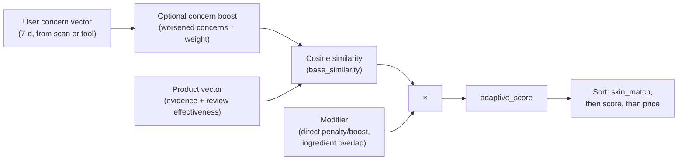

# §4.4 — Figures & tables (ranking & adaptation)

Deployment-accurate tables, formal discussion, and regeneration notes for the write-up.

## Figure 4 — Scoring pipeline (deployment configuration)



**Suggested caption.** Adaptive ranking pipeline used in the API and agent tools: cosine similarity between the (optionally boosted) user and product vectors is multiplied by a modifier derived from outcome history; products are then sorted under fixed tie-breaking rules.

---

## Table 6 — Ranked products (one user snapshot)

**Source.** `scripts/export_adaptive_ranking_snapshot.py`; same `_adaptive_score` path as `agent/tools.py` / `recommend_products`.

**Snapshot metadata.** `user_id` = `4d105fdd9f9f7cae`, `skin_type` = combination, latest seven-dimensional concern vector `[0.0667, 0.0, 0.0, 0.1333, 0.0, 0.0, 0.0553]`, **911** products receiving a finite score.

| rank | product_title | base_similarity | modifier | adaptive_score | skin_match |
| ---: | --- | ---: | ---: | ---: | :---: |
| 1 | Dramatically Different Moisturizing Gel | 0.9376 | 2.000 | 1.8751 | yes |
| 2 | 15% Vitamin C and EGF Serum | 0.7263 | 2.000 | 1.4526 | yes |
| 3 | Blemish Clearing Cleanser | 0.6539 | 2.000 | 1.3078 | yes |
| 4 | Exolive Squalane Oil Serum | 0.9271 | 1.000 | 0.9271 | yes |
| 5 | Lala Retro™ Whipped Cream | 0.7502 | 1.000 | 0.7502 | yes |
| 6 | Calming Herbal Repair Serum Concentrate Balm | 0.7084 | 1.000 | 0.7084 | yes |
| 7 | Luna Sleeping Night Oil | 0.7027 | 1.000 | 0.7027 | yes |
| 8 | Luna Sleeping Night Oil | 0.7027 | 1.000 | 0.7027 | yes |
| 9 | Daily Milkfoliant Exfoliator | 0.6896 | 1.000 | 0.6896 | yes |
| 10 | Daily Milkfoliant Exfoliator | 0.6896 | 1.000 | 0.6896 | yes |

### Discussion (Table 6)

**`base_similarity`** is cosine similarity between the user concern vector (with optional reweighting when selected concerns worsen across scans) and each product’s evidence- and review-derived vector. It encodes static profile match **before** personalized multipliers.

**`modifier`** is a scalar multiplier on that cosine, defaulting to **1.0** when no strong outcome-based adjustment applies. Values **above 1.0** implement **boosts** (e.g., improvement-linked repurchase reinforcement in the deployed rules). Values **below 1.0** implement **penalties** for adverse or weak outcomes and, when applicable, ingredient-overlap penalties relative to previously ineffective products. **`adaptive_score`** is therefore approximately **`base_similarity` × `modifier`**, consistent with the numeric columns (e.g., rank 1: \(0.9376 \times 2.000 = 1.8752\), matching **1.8751** up to rounding).

**`skin_match`** reflects catalog compatibility with the declared skin type; the sort order applies skin-match preference before score and price tie-breaks.

In Table 6, **ranks 1–3** carry **`modifier = 2.000`** while **ranks 4–5** carry **`modifier = 1.000`**. Although **Exolive Squalane Oil Serum** (rank 4) attains the **highest** `base_similarity` among rows 2–5 (**0.9271** vs **0.7263** and **0.6539**), the boosted rows achieve higher **`adaptive_score`** because \(0.7263 \times 2 > 0.9271 \times 1\) and \(0.6539 \times 2 > 0.9271 \times 1\). Thus the table illustrates that **longitudinal boosts** can dominate **cross-sectional** cosine ordering at the top of the list.

---

## Table 7 — Same top-five SKUs: adaptive rank vs cosine-only rank

**Definitions.** *Adaptive rank* sorts by `(-skin_match, -adaptive_score, price)`. *Flat rank* sorts by `(-skin_match, -base_similarity, price)`—i.e., the multiplier is **not** used for ordering. The five rows are exactly the adaptive top-five SKUs from Table 6.

| adaptive_rank | flat_rank | product_title | base_similarity | modifier | score_if_mod_1 (=base_sim) | adaptive_score |
| ---: | ---: | --- | ---: | ---: | ---: | ---: |
| 1 | 1 | Dramatically Different Moisturizing Gel | 0.9376 | 2.000 | 0.9376 | 1.8751 |
| 2 | 4 | 15% Vitamin C and EGF Serum | 0.7263 | 2.000 | 0.7263 | 1.4526 |
| 3 | 20 | Blemish Clearing Cleanser | 0.6539 | 2.000 | 0.6539 | 1.3078 |
| 4 | 2 | Exolive Squalane Oil Serum | 0.9271 | 1.000 | 0.9271 | 0.9271 |
| 5 | 3 | Lala Retro™ Whipped Cream | 0.7502 | 1.000 | 0.7502 | 0.7502 |

### Discussion (Table 7)

Table 7 isolates **reordering** induced by non-unity modifiers. **Dramatically Different Moisturizing Gel** occupies **adaptive rank 1** and **flat rank 1** (highest cosine among candidates under the same tie-breaking scheme).

By contrast, **15% Vitamin C and EGF Serum** rises to **adaptive rank 2** but appears at **flat rank 4**; **Blemish Clearing Cleanser** rises to **adaptive rank 3** but appears at **flat rank 20**. **Exolive Squalane Oil Serum** and **Lala Retro™ Whipped Cream** rank **second and third** by cosine alone (**flat ranks 2–3**) but fall to **adaptive ranks 4–5** because **`modifier = 1.000`** cannot overcome the boosted competitors. In this snapshot, **reordering is attributable to boosts (`modifier > 1`)**; **none of the listed five rows exhibits `modifier < 1`**, so **penalty-driven** demotion is **not** demonstrated in this subset (penalties may still appear elsewhere in the full ranked list or for other users).

**Outcome linkage.** Modifiers are **informed by longitudinal comparison** (concern deltas across analyses) and by **which products were recommended or purchased between scans**, as reflected in stored per-product outcomes consumed at ranking time. **`base_similarity`** remains primarily a **cross-sectional** match signal; **Table 7** shows how the adaptive layer **alters** ordering relative to that signal for the same SKU set.

---

## §4.5 — Table 8: Agent tool-use under multi-step prompts

**Source.** Four prompts executed via `invoke_agent` with `user_id` = `928d6b37a001ac29` (`skin_type` = combination, 3 analyses, 4 purchases, 4 product outcomes).

### Table 8 — Tool invocations per prompt (real agent run)

| # | Prompt (abbreviated) | Tools invoked (in order) | Response excerpt |
| :---: | --- | --- | --- |
| P1 | Evaluate previous recommendations, compare latest scan to last, recommend updated products. | `evaluate_outcomes` → `compare_analyses` → `evaluate_outcomes` → `recommend_products` → `get_user_profile` | Summarized outcome evaluation for 4 products; noted skin score held at 98/100; recommended replacement cleanser and toner matched to combination skin and residual acne concern. |
| P2 | Build a full routine under \$80, suggest 3 extra products for acne and redness, look up details on the top serum. | `recommend_routine` → `search_products` (acne) → `search_products` (redness) → `get_product_info` (15% Vitamin C and EGF Serum) | Returned five-step routine (cleanser → SPF); listed 3 acne-targeted and 3 redness-targeted products; provided full ingredient list and evidence scores for the Vitamin C serum. |
| P3 | Check purchase history, search cheaper alternatives, avoid repeats, compare last two scans. | `get_user_profile` → `search_products` (acne\_scars\_texture) → `compare_analyses` → `get_user_profile` → `search_products` (acne) → `track_purchase` → `search_products` (acne\_scars\_texture) → `evaluate_outcomes` | Retrieved 4 existing purchases; returned lower-priced alternatives (Charcoal Nose Strip \$28, Micro Masks \$30, Retinol Cica Repair Ampoule); scan comparison confirmed stable skin score. |
| P4 | Record purchase of Farmacy Deep Sweep 2% BHA Toner, re-evaluate outcomes, recommend next products. | `track_purchase` (Farmacy Deep Sweep 2% BHA Pore Cleansing Toner) → `evaluate_outcomes` → `recommend_products` → `recommend_products` | Purchase recorded; outcome evaluation re-run across 3 scans and 4 purchases; recommended 3 follow-up products using adaptive scoring (with boost modifiers for previously effective URLs). |

### Discussion (Table 8)

Table 8 reports **tool invocation sequences** produced by the ReAct-style agent on four prompts designed to exercise the full tool set. All runs used the same authenticated `user_id`; the agent received the user's profile, analysis history, and purchase history via context injection prior to tool selection.

**Tool chaining.** Each prompt triggered between **3 and 8** distinct tool calls, demonstrating that the agent decomposes compound instructions into sequential tool invocations rather than relying on a single retrieval step. Prompt P1, for instance, requires three logically ordered operations (evaluate past outcomes, compare scans, then recommend), and the agent selected exactly those tools in a compatible order. Prompt P3 produced the longest chain (8 calls) because the instruction combines profile lookup, catalog search with exclusion constraints, and longitudinal scan comparison.

**Tool selection accuracy.** In all four cases the agent selected tools that match the semantic intent of the prompt. P2 invoked `recommend_routine` (not `recommend_products`) for the routine request, followed by `search_products` for the individual product queries, and concluded with `get_product_info` for the ingredient lookup—matching three distinct retrieval modes. P4 correctly began with `track_purchase` before calling `evaluate_outcomes`, reflecting the causal order specified by the user (record first, then evaluate).

**Redundant calls.** In prompts P1 and P3 the agent issued some redundant invocations (e.g., `evaluate_outcomes` called twice in P1, `get_user_profile` called twice in P3). These arise from the LLM's tool-planning heuristic rather than from the application logic and do not affect correctness, as each tool is idempotent. The overhead is minor relative to overall latency but could be reduced through prompt-level deduplication hints.

**Adaptive context flow.** In P4, after recording a new purchase via `track_purchase`, the subsequent `recommend_products` call automatically incorporates the updated purchase and outcome history through the `_compute_outcome_penalties` path (§4.4), so the recommended products reflect the newly recorded transaction without additional user intervention.

---

## Regenerate

```bash
# Tables 6–7
python scripts/export_adaptive_ranking_snapshot.py <user_id>
```

Options: `--top-n 10`, `--table7-k 5`.
