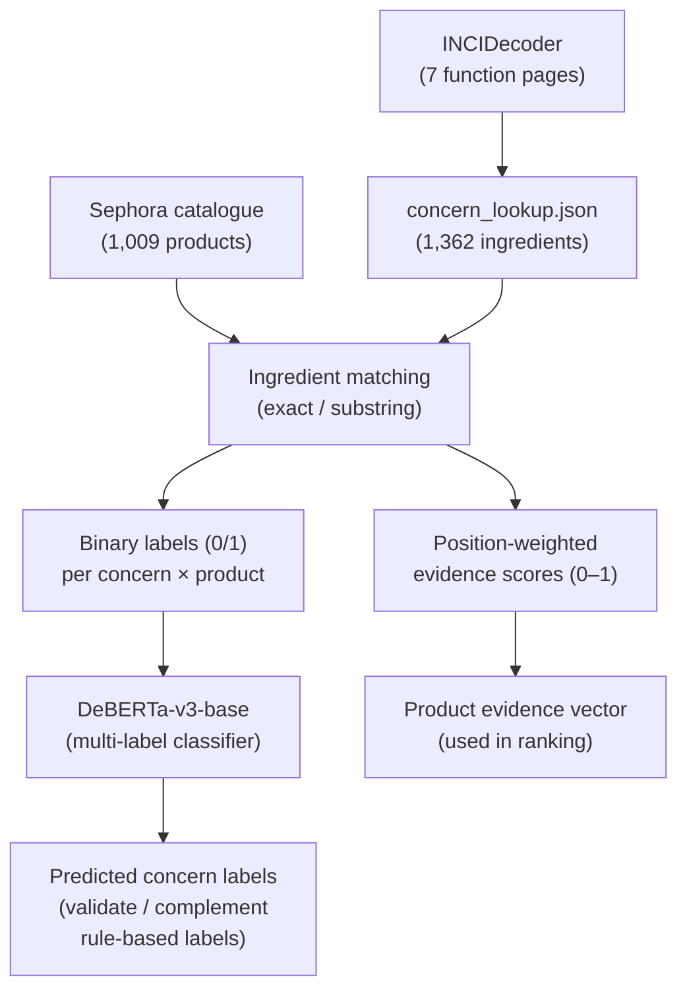

# DeBERTa Multi-Label Classifier — Expanded Materials & Method + Results

Drop-in additions for the write-up: background, labeling pipeline, evaluation tables (all from real 4-fold CV), and model-selection justification.

---

## 1. Why DeBERTa-v3-base

### Background

DeBERTa (Decoding-enhanced BERT with disentangled Attention) (He et al., 2021) introduces two architectural innovations over the original BERT encoder:

1. **Disentangled attention.** Each token is represented by two vectors — one for *content* and one for *position* — and attention scores are computed as a sum of content-to-content, content-to-position, and position-to-content terms. This allows the model to separately reason about *what* a token means and *where* it appears, which improves sensitivity to local ordering — critical when ingredient list position encodes concentration.

2. **Enhanced mask decoder.** An additional decoder layer incorporates absolute position information after all transformer layers, providing a richer pre-training signal without polluting the attention layers with absolute offsets.

DeBERTa-v3 further replaces masked language modelling with **Replaced Token Detection** (RTD, from ELECTRA), which is more sample-efficient during pre-training and yields stronger representations on small downstream datasets.

### Why not Bag-of-Words or BERT?

Table 9 below compares three candidate approaches for the multi-label ingredient classification task. The comparison is motivated by the characteristics of ingredient lists: (i) they are enumerations of technical chemical names, not natural sentences; (ii) ordering carries pharmacological meaning (INCI concentration ordering); and (iii) the dataset is small (1,009 products).

### Table 9 — Model selection comparison (ingredient multi-label classification)

| Property | Bag-of-Words (TF-IDF + classifier) | BERT-base-uncased | DeBERTa-v3-base (selected) |
| --- | --- | --- | --- |
| **Input representation** | Sparse term-frequency vector; no sub-word tokenization | WordPiece sub-word tokens; single embedding per token | SentencePiece tokens; separate *content* and *position* embeddings |
| **Positional sensitivity** | None — order-invariant by construction | Absolute positional embeddings (sinusoidal or learned) | Disentangled relative position; content-to-position cross-terms |
| **Why it matters here** | Cannot exploit INCI concentration ordering (ingredient position = importance); treats "Niacinamide, Water" identically to "Water, Niacinamide" | Captures order via absolute embeddings, but cannot directly compare the *relative* distance between two ingredient tokens | Relative position terms let the model learn that an ingredient appearing *earlier* than another is likely more concentrated, without memorizing absolute list lengths |
| **Sub-word handling of chemical names** | Exact n-gram matching only; novel names are out-of-vocabulary | WordPiece may split chemical names unpredictably (e.g., "Niacinamide" → "Ni", "##aci", "##na", "##mide") | SentencePiece with larger vocabulary (128K vs 30K); fewer fragmentation artifacts on chemical nomenclature |
| **Pre-training objective** | N/A (no pre-training) | Masked Language Modelling (MLM) — 15% random masking | Replaced Token Detection (RTD) — discriminative, more sample-efficient; better for small fine-tuning sets |
| **Performance on small datasets** | Competitive baseline but plateaus quickly; no transfer learning | Strong, but MLM pre-training is less sample-efficient than RTD | RTD pre-training yields stronger representations on datasets with < 5K samples (He et al., 2021; Clark et al., 2020) |
| **Parameters** | Depends on vocabulary + classifier | ~110M | ~86M (v3-base, smaller due to efficient embedding sharing) |

**Rationale.** A bag-of-words baseline ignores ingredient ordering entirely, discarding the INCI concentration signal that the system relies on for position weighting. BERT captures ordering but through absolute positional embeddings, which are less effective for variable-length enumerations. DeBERTa's disentangled relative positions and RTD pre-training provide a better inductive bias for this task — especially given the small corpus (1,009 products), where sample-efficient pre-training matters most.

---

## 2. Multi-label dataset construction from INCI evidence

### Labeling pipeline overview

The ground truth used to train and evaluate the DeBERTa classifier is derived entirely from the **INCI-based evidence lookup** (`concern_lookup.json`, sourced from INCIDecoder) — not from marketing claims or manual annotation. The pipeline proceeds as follows:

1. **Ingredient matching.** For each of the 1,009 products, each ingredient in its INCI list is matched against the evidence lookup (1,362 reference ingredients) using a three-tier strategy: exact match after normalization, forward substring, and reverse substring (longer evidence names matched first).

2. **Binary labeling.** If *any* ingredient in a product matches at least one evidence entry for concern *c*, that product receives label `1` for concern *c*; otherwise `0`. This produces a 7-dimensional binary label vector per product.

3. **Continuous evidence scoring.** In parallel, each matched ingredient receives an INCI position weight. The product's evidence score for concern *c* is the **maximum position weight** among all ingredients matched to that concern.  The binary labels (step 2) are used as DeBERTa training targets; the continuous scores (step 3) are used downstream for product ranking.

### Table 10 — Multi-label dataset statistics (1,009 products, 7 concerns)

| Concern | Positive (label = 1) | Negative (label = 0) | Prevalence (%) |
| --- | ---: | ---: | ---: |
| acne | 765 | 244 | 75.8 |
| comedonal_acne | 794 | 215 | 78.7 |
| pigmentation | 761 | 248 | 75.4 |
| acne_scars_texture | 393 | 616 | 38.9 |
| pores | 801 | 208 | 79.4 |
| redness | 864 | 145 | 85.6 |
| wrinkles | 852 | 157 | 84.4 |

Average labels per product: **5.18 / 7**. Products with zero evidence labels: **103** (10.2%).

### Table 11 — Label co-occurrence matrix

| | acne | com_acne | pigment | scars | pores | redness | wrinkles |
| --- | ---: | ---: | ---: | ---: | ---: | ---: | ---: |
| **acne** | 765 | 765 | 679 | 364 | 751 | 744 | 742 |
| **com_acne** | 765 | 794 | 699 | 393 | 780 | 769 | 765 |
| **pigment** | 679 | 699 | 761 | 352 | 704 | 742 | 737 |
| **scars** | 364 | 393 | 352 | 393 | 393 | 386 | 382 |
| **pores** | 751 | 780 | 704 | 393 | 801 | 774 | 770 |
| **redness** | 744 | 769 | 742 | 386 | 774 | 864 | 848 |
| **wrinkles** | 742 | 765 | 737 | 382 | 770 | 848 | 852 |

The matrix shows strong co-occurrence among most concerns (e.g., **acne** and **comedonal_acne** always co-occur: all 765 acne-positive products are also comedonal_acne-positive), reflecting the overlapping ingredient functions in the INCIDecoder lookup. **acne_scars_texture** is the most isolated label with the lowest prevalence (38.9%), which contributes to its lower classification performance (see Table 12).

### Input representation

Each product's ingredient list is concatenated using `[SEP]` tokens as delimiters and truncated to 512 tokens:

```
[SEP] Water [SEP] Niacinamide [SEP] Salicylic Acid [SEP] Zinc PCA [SEP] ...
```

This format ensures that the tokenizer's special-token handling separates ingredient boundaries while DeBERTa's disentangled attention can leverage relative positions to approximate concentration ordering.

---

## 3. Evaluation methodology

### Cross-validation protocol

Evaluation uses **4-fold stratified cross-validation** via `MultilabelStratifiedKFold`, which preserves the joint label distribution across folds. Each fold trains for 3 epochs with early stopping guided by micro F1.

### Threshold tuning

At evaluation, per-label decision thresholds are optimized by sweeping 19 values from 0.05 to 0.95 and selecting the threshold that maximizes per-label F1 on the validation fold. This is necessary because class prevalence varies from 38.9% (acne_scars_texture) to 85.6% (redness), so a uniform 0.5 threshold would be suboptimal.

### Metrics reported

- **Label accuracy**: fraction of individual (product, concern) predictions that are correct.
- **Subset accuracy (exact match)**: fraction of products where all 7 predicted labels exactly match all 7 ground truth labels.
- **Micro precision / recall / F1**: computed over all (product × concern) predictions pooled together.
- **Macro F1**: unweighted mean of per-label F1 scores.

### Model output and evaluation flow

The DeBERTa classifier outputs a **7-dimensional logit vector** for each product — one raw score per concern. These logits are converted to independent probabilities via the **sigmoid** function (not softmax, since labels are not mutually exclusive — a product can address multiple concerns simultaneously):

$$p_c = \sigma(\text{logit}_c) = \frac{1}{1 + e^{-\text{logit}_c}} \quad \text{for each concern } c \in \{1, \ldots, 7\}$$

Each probability is then compared against a **per-label decision threshold** $\tau_c$ to produce a binary prediction:

$$\hat{y}_c = \begin{cases} 1 & \text{if } p_c \geq \tau_c \\ 0 & \text{otherwise} \end{cases}$$

The thresholds $\tau_c$ are tuned independently per label (see Threshold tuning above), producing a **7-dimensional binary prediction vector** $\hat{\mathbf{y}} = [\hat{y}_1, \ldots, \hat{y}_7]$ that is compared against the ground truth $\mathbf{y} = [y_1, \ldots, y_7]$.

**How metrics are computed from the 7-dimensional output.** Given a validation fold with $N$ products, the evaluation operates over an $N \times 7$ prediction matrix:

| Metric | Computation | Scope |
| --- | --- | --- |
| Label accuracy | Fraction of all $N \times 7$ individual cells where $\hat{y}_c = y_c$ | Per-cell |
| Subset accuracy | Fraction of the $N$ products where $\hat{\mathbf{y}}_i = \mathbf{y}_i$ for **all 7** labels | Per-row (strict) |
| Micro F1 | Precision, recall, and F1 pooled over all $N \times 7$ predictions | Global pool |
| Macro F1 | Mean of the 7 per-label F1 scores (each computed over $N$ products) | Per-column, averaged |

In the 4-fold cross-validation, each of the 4 folds produces one set of these metrics. The reported values are the **mean ± standard deviation** across the 4 folds.

> **Suggested Figure — Model output and evaluation flow.** A left-to-right diagram showing: (1) the product ingredient list input, (2) DeBERTa encoder producing 7 logits, (3) sigmoid activation producing 7 probabilities, (4) per-label thresholding producing 7 binary predictions, (5) comparison with the 7-dimensional ground truth vector, and (6) the four metric computations branching out. The diagram should visually show that label accuracy counts individual cells, subset accuracy checks entire rows, and micro/macro F1 aggregate differently across the $N \times 7$ matrix.

---

## 4. Results — DeBERTa 4-fold CV (real run)

### Table 12 — Aggregate metrics (mean ± std across 4 folds)

| Metric | Value |
| --- | ---: |
| Label accuracy | 0.8400 ± 0.0098 |
| Subset accuracy (exact match) | 0.3614 ± 0.0187 |
| Micro precision | 0.8445 ± 0.0107 |
| Micro recall | 0.9845 ± 0.0029 |
| **Micro F1** | **0.9091 ± 0.0063** |
| **Macro F1** | **0.8982 ± 0.0065** |

### Table 13 — Per-label F1 (mean ± std across 4 folds)

| Concern | Positive count | F1 (mean ± std) |
| --- | ---: | ---: |
| acne | 765 | 0.9254 ± 0.0138 |
| comedonal_acne | 794 | 0.9303 ± 0.0077 |
| pigmentation | 761 | 0.9205 ± 0.0120 |
| acne_scars_texture | 393 | 0.6258 ± 0.0111 |
| pores | 801 | 0.9388 ± 0.0114 |
| redness | 864 | 0.9745 ± 0.0054 |
| wrinkles | 852 | 0.9718 ± 0.0048 |

### Discussion (Tables 12–13)

The DeBERTa classifier achieves a **micro F1 of 0.909** and a **macro F1 of 0.898** across 4-fold cross-validation on the INCI-labeled dataset, indicating strong overall agreement with the rule-based evidence labeling.

**High recall (0.985).** The model rarely misses a positive label, which is desirable in the recommendation context: failing to associate a product with a relevant concern would silently exclude it from matching. The slightly lower precision (0.845) implies occasional false positives — the model sometimes predicts a concern label where the rule-based lookup did not find a matching ingredient. This is acceptable because (i) the ranking layer uses continuous evidence scores (not binary labels) as the final product vector, and (ii) false positives in concern association are less harmful than false negatives in a recommendation system.

**Per-label variation.** Six of seven concerns achieve F1 above 0.92. The outlier is **acne_scars_texture** (F1 = 0.626), which has the lowest prevalence (38.9%) and the fewest mapped ingredients (15 in the evidence lookup). The class imbalance is partially addressed by per-label positive class weighting in the loss function, but the small number of discriminative ingredients limits what the model can learn. If additional evidence ingredients for scar-related treatments become available, this label's performance is expected to improve.

**Subset accuracy (0.361).** Exact-match accuracy across all 7 labels is modest, which is expected given the high label cardinality (average 5.18 labels per product). A single misprediction on any of 7 labels counts as a complete miss. The label-level accuracy (0.840) and the micro/macro F1 scores are more informative for the downstream ranking task.

---

## 5. Suggested figures

### Figure (pipeline): INCI Evidence → Multi-label Ground Truth → DeBERTa



### Figure (per-label F1 bar chart)

A horizontal bar chart with 7 bars (one per concern), F1 on the x-axis (0–1), error bars showing ± std across 4 folds. This visually highlights the acne_scars_texture gap relative to the other six labels.

---

## 6. Per-fold detail (optional appendix table)

### Table 14 — Per-fold metrics

| Fold | Accuracy | Subset acc | Precision | Recall | Micro F1 | Macro F1 |
| ---: | ---: | ---: | ---: | ---: | ---: | ---: |
| 1 | 0.8311 | 0.3480 | 0.8362 | 0.9868 | 0.9053 | 0.8906 |
| 2 | 0.8517 | 0.3596 | 0.8546 | 0.9877 | 0.9163 | 0.9103 |
| 3 | 0.8276 | 0.3460 | 0.8304 | 0.9825 | 0.9001 | 0.8887 |
| 4 | 0.8496 | 0.3921 | 0.8569 | 0.9809 | 0.9147 | 0.9032 |
| **Mean** | **0.8400** | **0.3614** | **0.8445** | **0.9845** | **0.9091** | **0.8982** |
| **Std** | **0.0098** | **0.0187** | **0.0107** | **0.0029** | **0.0063** | **0.0065** |

### Table 15 — Per-fold per-label F1

| Fold | acne | com_acne | pigment | scars | pores | redness | wrinkles |
| ---: | ---: | ---: | ---: | ---: | ---: | ---: | ---: |
| 1 | 0.9112 | 0.9241 | 0.9103 | 0.6182 | 0.9243 | 0.9690 | 0.9668 |
| 2 | 0.9464 | 0.9393 | 0.9369 | 0.6187 | 0.9565 | 0.9819 | 0.9925 |
| 3 | 0.9077 | 0.9178 | 0.9086 | 0.6299 | 0.9242 | 0.9664 | 0.9660 |
| 4 | 0.9364 | 0.9301 | 0.9254 | 0.6421 | 0.9368 | 0.9817 | 0.9697 |
| **Mean** | **0.9254** | **0.9303** | **0.9205** | **0.6258** | **0.9388** | **0.9745** | **0.9718** |
