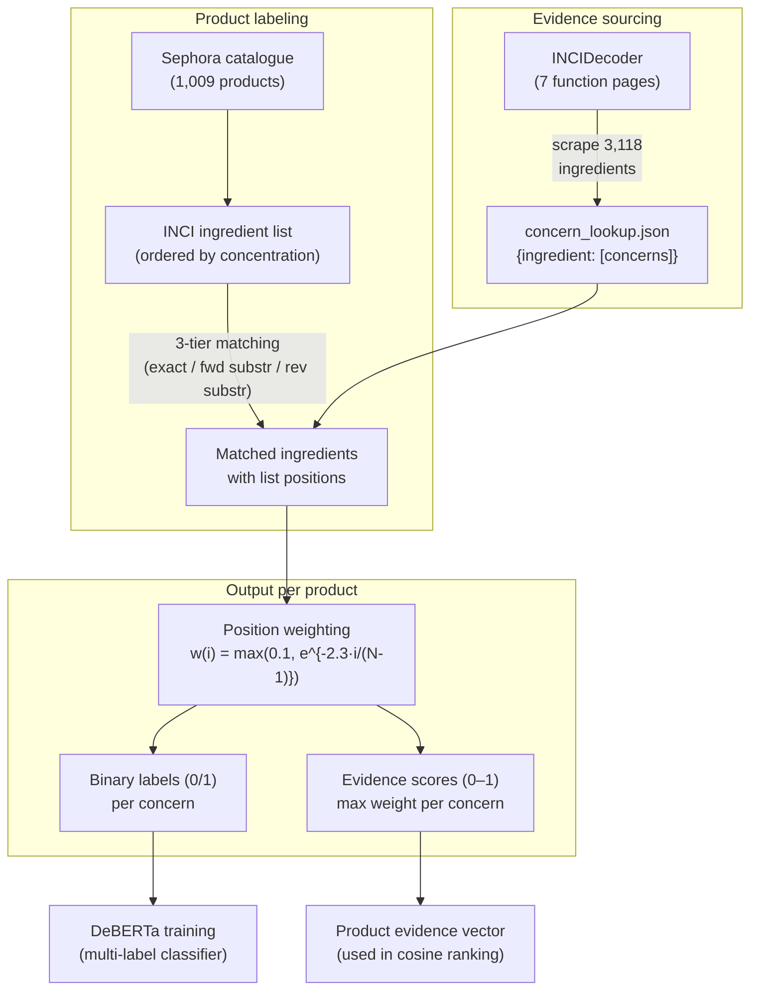

# Ingredient Analyzer — Expanded Materials & Method

Revised and expanded version of the ingredient analyzer subsection, with INCI background, scraping methodology, labeling pipeline, position weighting, and a fully worked example from a real product.

---

## 1. INCI Background

### What is INCI

The **International Nomenclature of Cosmetic Ingredients** (INCI) is a standardized naming system for cosmetic ingredients established by the Personal Care Products Council (PCPC) and adopted internationally under regulations including the **EU Cosmetics Regulation (EC 1223/2009)** and the **U.S. Fair Packaging and Labeling Act**. Under these regulations, manufacturers are required to list all ingredients on product packaging using their standardized INCI names (e.g., "Tocopherol" rather than "Vitamin E", "Ascorbic Acid" rather than "Vitamin C").

### Why INCI matters for this system

INCI lists carry two properties that make them a reliable signal for ingredient-level analysis:

1. **Standardized nomenclature.** Because all manufacturers use the same naming convention, an ingredient like "Niacinamide" appearing in product A and product B refers to the same chemical compound, enabling exact matching across the entire catalogue without synonym resolution.

2. **Concentration ordering.** Under EU and most international regulations, ingredients present at concentrations **above 1%** must be listed in **descending order of concentration**. Ingredients at or below 1% may appear in any order after the above-1% group. This ordering encodes approximate concentration information directly in the list structure — the earlier an ingredient appears, the more of it the product contains. The system exploits this via position weighting (Section 4 below).

---

## 2. Evidence data sourcing (INCIDecoder)

### What is INCIDecoder

INCIDecoder (incidecoder.com) is a publicly accessible dermatological reference database that catalogues cosmetic ingredients by their **scientifically established functions** (e.g., anti-acne, skin-brightening, soothing, exfoliant). Each function page lists all ingredients known to perform that function, curated from published dermatological literature.

### Scraping methodology

The scraper (`scripts/scrape_incidecoder.py`) requests **7 primary function category pages** from INCIDecoder via paginated HTML parsing:

| INCIDecoder function page | Description |
| --- | --- |
| `anti-acne` | Ingredients with acne-fighting properties |
| `skin-brightening` | Ingredients that reduce hyperpigmentation |
| `soothing` | Ingredients that reduce irritation and redness |
| `exfoliant` | Chemical and physical exfoliants |
| `cell-communicating-ingredient` | Ingredients that promote cell turnover (anti-aging) |
| `astringent` | Ingredients that tighten and minimize pores |
| `antioxidant` | Ingredients that protect against oxidative damage |

Three supplementary pages (`surfactant-cleansing`, `abrasive-scrub`, `moisturizer-humectant`) are also scraped to expand coverage. For each page, every ingredient listed is extracted with its standardized name, yielding two output files:

- `ingredient_evidence.json` — raw mapping: `{ingredient_name: [functions]}`
- `concern_lookup.json` — mapped to the 7-concern taxonomy: `{ingredient_name: [concerns]}`

The final lookup contains **3,118 unique ingredient entries** after merging across all function pages.

### Function-to-concern mapping

Each INCIDecoder function is mapped to one or more of the 7 skin concerns in the system's taxonomy:

| INCIDecoder function | Mapped concern(s) |
| --- | --- |
| anti-acne | acne, comedonal_acne |
| skin-brightening | pigmentation |
| soothing | redness |
| exfoliant | pores, acne_scars_texture, comedonal_acne |
| cell-communicating-ingredient | wrinkles |
| astringent | pores |
| antioxidant | pigmentation |

This mapping reflects dermatological consensus: for example, exfoliants address pore congestion, textural scarring, and comedonal (non-inflammatory) acne simultaneously, so the `exfoliant` function maps to three concerns.

### Evidence ingredients per concern

After mapping, the number of evidence ingredients available per concern is:

| Concern | Evidence ingredients |
| --- | ---: |
| pores | 1,460 |
| comedonal_acne | 1,173 |
| redness | 982 |
| acne | 973 |
| wrinkles | 863 |
| pigmentation | 848 |
| acne_scars_texture | 203 |

The disparity (especially acne_scars_texture with only 203 ingredients) reflects the narrower pharmacological landscape for scar-treatment actives compared to broadly functional categories like pore-targeting agents.

---

## 3. Product labeling pipeline

### Product catalogue

The product catalogue is scraped from Sephora Hong Kong (sephora.com.hk), yielding **1,009 products** with valid INCI ingredient lists. Each product record includes the full ordered ingredient list, product metadata (title, brand, price, category), and marketing claims.

### Three-tier ingredient matching

For each product, every ingredient in its INCI list is matched against the concern lookup (`concern_lookup.json`) using a three-tier strategy, applied in order of priority:

```
Tier 1: Exact match after normalization (lowercasing, whitespace collapsing)
        e.g., "Tocopherol" == "tocopherol" ✓

Tier 2: Forward substring — evidence name found within the product ingredient
        (minimum 5 characters to avoid spurious partial matches)
        e.g., "Ascorbic Acid" found in "Ascorbyl Tetraisopalmitate / Ascorbic Acid Derivative" ✓

Tier 3: Reverse substring — product ingredient found within an evidence name
        e.g., product lists "Zinc PCA", evidence has "Zinc PCA (Zinc L-Pyrrolidone Carboxylate)" ✓
```

Longer evidence names are matched first to prefer specific matches over generic ones (e.g., "Sodium Hyaluronate Crosspolymer" is matched before "Sodium").

### Binary labeling

If **any** ingredient in a product matches at least one evidence entry for concern *c*, that product receives **label 1** for concern *c*; otherwise **label 0**. This produces a **7-dimensional binary label vector** per product, which serves as the ground truth for DeBERTa training.

---

## 4. INCI position weighting

### Rationale

Because INCI regulations require ingredients above 1% concentration to be listed in descending order, the **position** of an ingredient in the list is an approximate proxy for its **concentration** in the formulation. An active ingredient listed first (position 0) is present at a higher concentration — and thus more pharmacologically relevant — than the same ingredient listed near the end.

### Weight formula

An exponential decay function assigns a weight based on list position:

$$w(i) = \max\!\left(0.1,\; e^{-2.3 \cdot \frac{i}{N-1}}\right)$$

where *i* is the 0-indexed position and *N* is the total number of ingredients.

This yields:
- **Position 0** (first ingredient): $w \approx 1.0$
- **Mid-list** ($i = N/2$): $w \approx 0.32$
- **Last position** ($i = N-1$): $w = 0.1$ (floor — never zero)

The decay constant $-2.3$ is chosen so that the weight at the last position equals $e^{-2.3} \approx 0.1$, ensuring that even trailing ingredients contribute a non-zero but substantially reduced score.

### Per-concern evidence score

For each concern *c*, the product's evidence score is the **maximum** position weight among all matched ingredients for that concern:

$$\text{score}_c = \max_{m \in M_c} w(\text{pos}(m))$$

where $M_c$ is the set of matched ingredients for concern *c*. Using the **maximum** (rather than sum or mean) reflects the pharmacological principle that a product's effectiveness for a concern is primarily driven by its **most concentrated** active ingredient for that purpose.

---

## 5. Worked example

### Product: Anua Heartleaf Pore Control Cleansing Oil

INCI list (22 ingredients, scraped from Sephora HK):

| Position *i* | Ingredient | Matched? | Mapped concerns | Weight $w(i)$ |
| ---: | --- | :---: | --- | ---: |
| 0 | Ethylhexyl Palmitate | — | — | 1.0000 |
| 1 | Sorbeth-30 Tetraoleate | **yes** | redness, wrinkles | **0.8963** |
| 2 | Sorbitan Sesquioleate | — | — | 0.8030 |
| 3 | Caprylic/Capric Triglyceride | **yes** | acne, comedonal_acne, pores | **0.7200** |
| 4 | Butyl Avocadate | — | — | 0.6450 |
| 5 | Parfum/Fragrance | — | — | 0.5781 |
| 6 | Helianthus Annuus Seed Oil | — | — | 0.5181 |
| 7 | Macadamia Ternifolia Seed Oil | — | — | 0.4643 |
| 8 | Olea Europaea Fruit Oil | — | — | 0.4161 |
| 9 | Simmondsia Chinensis Seed Oil | — | — | 0.3729 |
| 10 | Vitis Vinifera Seed Oil | — | — | 0.3342 |
| 11 | Caprylyl Glycol | **yes** | redness, wrinkles | **0.2998** |
| 12 | Ethylhexylglycerin | **yes** | redness, wrinkles | **0.2687** |
| 13 | Curcuma Longa Root Extract | — | — | 0.2408 |
| 14 | Melia Azadirachta Flower Extract | — | — | 0.2158 |
| 15 | Tocopherol | **yes** | pigmentation | **0.1934** |
| 16 | Melia Azadirachta Leaf Extract | — | — | 0.1734 |
| 17 | Houttuynia Cordata Extract | **yes** | pigmentation, redness | **0.1554** |
| 18 | Corallina Officinalis Extract | — | — | 0.1393 |
| 19 | Melia Azadirachta Bark Extract | — | — | 0.1248 |
| 20 | Moringa Oleifera Seed Oil | — | — | 0.1119 |
| 21 | Ocimum Sanctum Leaf Extract | — | — | 0.1000 |

### Step-by-step evidence score calculation

**Step 1 — Match.** Six of 22 ingredients match against the evidence lookup.

**Step 2 — Map to concerns.** Each matched ingredient maps to one or more concerns via the lookup:

| Matched ingredient | Position | Weight | Concerns |
| --- | ---: | ---: | --- |
| Sorbeth-30 Tetraoleate | 1 | 0.8963 | redness, wrinkles |
| Caprylic/Capric Triglyceride | 3 | 0.7200 | acne, comedonal_acne, pores |
| Caprylyl Glycol | 11 | 0.2998 | redness, wrinkles |
| Ethylhexylglycerin | 12 | 0.2687 | redness, wrinkles |
| Tocopherol | 15 | 0.1934 | pigmentation |
| Houttuynia Cordata Extract | 17 | 0.1554 | pigmentation, redness |

**Step 3 — Per-concern max.** For each concern, take the maximum weight among all contributing ingredients:

| Concern | Contributing ingredients (weight) | $\text{score}_c = \max$ | Binary label |
| --- | --- | ---: | :---: |
| acne | Caprylic/Capric Triglyceride (0.720) | **0.720** | 1 |
| comedonal_acne | Caprylic/Capric Triglyceride (0.720) | **0.720** | 1 |
| pigmentation | Tocopherol (0.193), Houttuynia Cordata (0.155) | **0.193** | 1 |
| acne_scars_texture | *(none)* | **0.000** | 0 |
| pores | Caprylic/Capric Triglyceride (0.720) | **0.720** | 1 |
| redness | Sorbeth-30 (0.896), Caprylyl Glycol (0.300), Ethylhexylglycerin (0.269), Houttuynia Cordata (0.155) | **0.896** | 1 |
| wrinkles | Sorbeth-30 (0.896), Caprylyl Glycol (0.300), Ethylhexylglycerin (0.269) | **0.896** | 1 |

**Interpretation.** Redness and wrinkles receive the highest evidence scores (0.896) because the highest-ranked matched ingredient (Sorbeth-30 Tetraoleate, position 1) maps to those concerns. Pigmentation receives a lower score (0.193) because its only contributing ingredients appear late in the list (positions 15 and 17), suggesting low concentration. Acne_scars_texture receives 0 because no matched ingredient maps to that concern.

---

## 6. Suggested figures

### Figure A — INCI position weight decay curve

A line plot with:
- **x-axis:** Normalized position $i/(N-1)$ from 0 to 1
- **y-axis:** Weight $w(i)$ from 0 to 1
- The exponential decay curve $w = e^{-2.3t}$ from 1.0 down to 0.1
- A horizontal dashed line at $w = 0.1$ (floor)
- Annotated points for position 0 (w=1.0), midpoint (w≈0.32), last (w=0.1)

**Caption:** INCI position weight function. Ingredients listed earlier receive higher weights, reflecting the regulatory requirement that above-1% ingredients are listed in descending concentration order. The floor at 0.1 ensures trailing ingredients still contribute.

### Figure B — Full labeling pipeline (INCIDecoder → product labels)



**Caption:** End-to-end ingredient evidence pipeline. INCIDecoder function pages are scraped and mapped to the 7-concern taxonomy to build an evidence lookup. Each product's INCI list is matched against this lookup; matched ingredients receive position-dependent weights reflecting approximate concentration. The outputs are (1) binary labels for DeBERTa training and (2) continuous evidence scores for the product ranking vector.

### Figure C — Worked example (visual)

A vertical diagram for the Anua Heartleaf product showing:
- Left column: the 22-ingredient INCI list with position numbers
- Middle: arrows from the 6 matched ingredients to a "concern mapping" box
- Right: the resulting 7-dimensional evidence score vector as a horizontal bar chart

This can be drawn manually or generated with a plotting library; it shows one concrete product flowing through the pipeline.

---

## 7. INCI evidence score statistics (across full catalogue)

Table (already in the draft, reproduced for completeness):

| Concern | Products with evidence | Mean score | Min | Max |
| --- | ---: | ---: | ---: | ---: |
| pigmentation | 815 | 0.595 | 0.100 | 1.000 |
| redness | 713 | 0.619 | 0.100 | 1.000 |
| pores | 647 | 0.598 | 0.100 | 1.000 |
| comedonal_acne | 460 | 0.588 | 0.100 | 1.000 |
| wrinkles | 405 | 0.535 | 0.100 | 1.000 |
| acne_scars_texture | 312 | 0.506 | 0.100 | 1.000 |
| acne | 308 | 0.586 | 0.100 | 1.000 |

All minimums are 0.100 (the floor weight, indicating a match only at the last ingredient position). All maximums are 1.000 (a match at position 0, the first ingredient). Mean scores cluster between 0.5 and 0.6, indicating that matched ingredients are spread across list positions rather than concentrated at the top or bottom.
