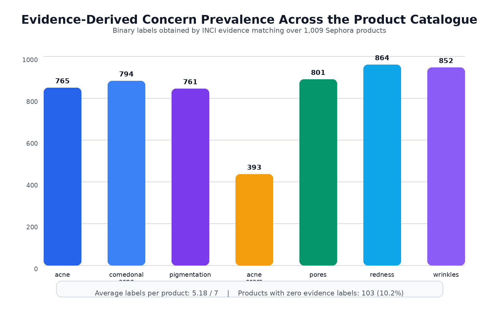
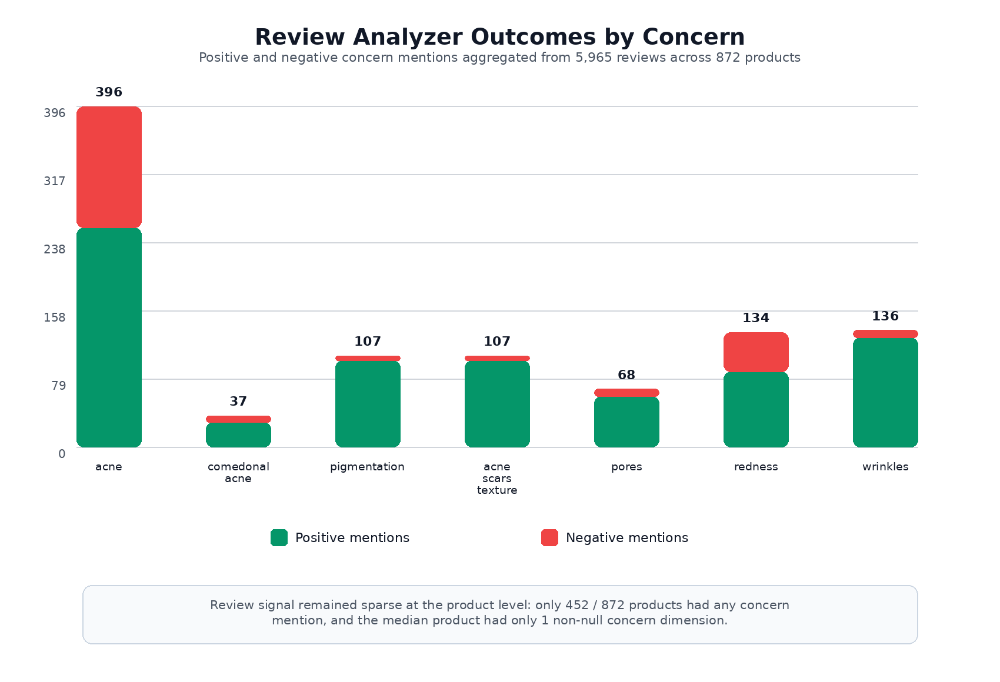
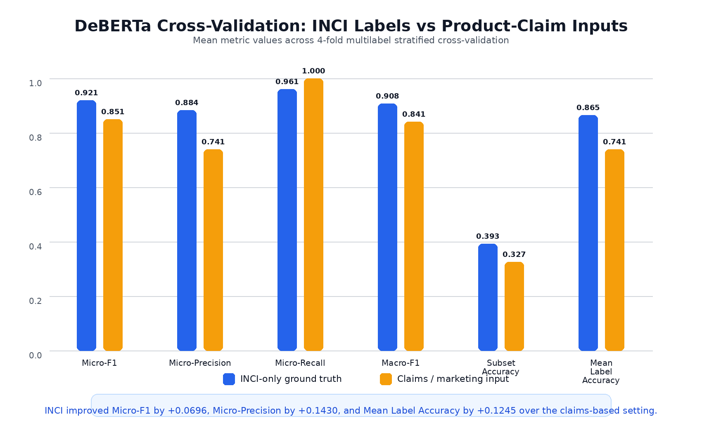
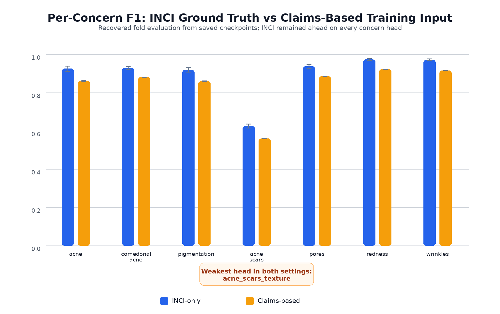
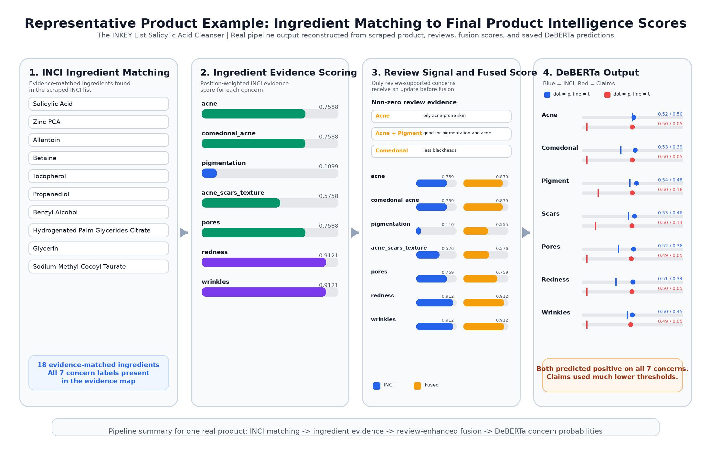

# 4.3 Product Intelligence: INCI Evidence, Reviews, and DeBERTa

This section reports the empirical behavior of the product-intelligence layer in Ruvisa, which combined three complementary sources of information: rule-based ingredient evidence derived from INCI lists, rule-based aggregation of user reviews, and a DeBERTa multi-label classifier trained to reproduce concern labels from product text. Taken together, these components determined how each product was represented in the shared seven-concern space used later by the ranking and recommendation modules.

The central finding was that **INCI-based ingredient analysis provided the most reliable and most stable product signal**, while **review aggregation contributed useful but sparse experiential evidence**, and **claims-oriented text performed worse than INCI text as a supervised input for DeBERTa**. This result supports the design choice made in Ruvisa: ingredient evidence should remain the primary product-intelligence backbone, while reviews and marketing text should be treated as secondary signals for calibration, retrieval, or explanation rather than as standalone substitutes.

## 4.3.1 INCI Evidence Mapping Results

The INCI evidence pipeline mapped the Sephora Hong Kong catalogue into the seven-concern taxonomy by matching product ingredient lists against the `concern_lookup.json` evidence base derived from INCIDecoder. This produced binary concern labels and continuous evidence scores for **1,009 products**. The evidence-derived label distribution was dense rather than sparse: most products received multiple positive concern labels, and the average product was associated with **5.18 concerns out of 7**. Only **103 products (10.2%)** received zero evidence labels.

**Figure 7.** Evidence-derived concern prevalence across the product catalogue. Binary concern labels were obtained by matching scraped INCI lists against the INCIDecoder-derived evidence lookup for 1,009 products.

Figure 7 shows that the evidence-derived labels were highly prevalent for most concerns. `redness` was the most common label (**864 products**), followed by `wrinkles` (**852**), `pores` (**801**), `comedonal_acne` (**794**), `acne` (**765**), and `pigmentation` (**761**). By contrast, `acne_scars_texture` appeared in only **393 products**, making it the most selective concern in the taxonomy. This asymmetry was important because it revealed a structural property of the evidence space itself: some skincare concerns are supported by broad families of multifunctional ingredients, whereas others rely on a smaller set of more specialized actives.

From a results perspective, this mapping behavior was desirable for two reasons. First, it showed that the ingredient analyzer did not merely recover a narrow subset of the catalogue; it generated broad concern coverage across the majority of products, which is important for downstream recommendation coverage. Second, it preserved a meaningful distinction between broad concern families and harder, more specific targets. The comparatively low prevalence of `acne_scars_texture` was not a weakness of the pipeline by itself; rather, it reflected the fact that texture- and scar-oriented evidence is pharmacologically narrower than evidence for concerns such as pores, redness, or anti-aging.

The pattern also has an interpretive implication for recommendation. Because many products were labeled positive for several concerns simultaneously, the product space was inherently **multi-functional** rather than one-label-per-product. That is consistent with real skincare formulations, where the same ingredient can contribute to multiple concerns. In practical terms, this meant the ranking engine could search for partial alignment between a user's concern vector and a product's mixed evidence profile, rather than forcing products into overly simplistic single-purpose categories.

At the same time, the density of the INCI label space explains why exact-match prediction later became harder for DeBERTa than label-wise accuracy. When products carry many simultaneous positive labels, predicting all seven dimensions perfectly becomes strict even if the model is broadly correct on most individual labels. This is therefore not only a modeling issue but also a property of the product-intelligence target itself.

## 4.3.2 Rule-Based Review Aggregation: Product-Level Experiential Signal

The review analyzer transformed unstructured review text into product-level experiential evidence by detecting concern mentions, assigning polarity per concern (`-1`, `0`, `+1`), and aggregating these outcomes across reviews belonging to the same SKU. In total, the review corpus contained **5,965 reviews** spanning **872 products**, with a mean of **6.8 reviews per product**. However, the resulting concern-level signal remained sparse once mapped into the seven-concern space.

Only **452 of 872 reviewed products** had at least one concern mention after rule-based extraction, while **420 products** had no usable concern mention at all. Across all reviewed products, the mean number of non-null concern dimensions was **0.84**, and the median product had only **1 non-null concern dimension**. This finding is important because it shows that review data, despite being plentiful in raw volume, did not translate into dense structured concern evidence for every product.

| Review aggregation summary | Value |
| --- | ---: |
| Total reviews analyzed | 5,965 |
| Products with reviews | 872 |
| Mean reviews per product | 6.8 |
| Median reviews per product | 8 |
| Products with at least one concern mention | 452 |
| Products with no concern mention | 420 |
| Mean non-null concern dimensions per product | 0.84 |
| Median non-null concern dimensions per product | 1 |

**Figure 8.** Positive and negative review mentions by concern after rule-based aggregation. Counts are pooled across all analyzed reviews and then assigned back to product-level concern summaries.

Figure 8 shows that the experiential review signal was unevenly distributed across concerns. `acne` had the highest total mention count (**396**), followed by `wrinkles` (**136**), `redness` (**134**), `pigmentation` (**107**), `acne_scars_texture` (**107**), `pores` (**68**), and `comedonal_acne` (**37**). Two patterns are especially notable.

First, `acne` and `redness` had the most balanced polarity distributions. Acne mentions were **255 positive** and **141 negative**, while redness mentions were **88 positive** and **46 negative**. This suggests that these concerns produced the richest experiential discrimination in the review corpus: users discussed them often enough, and both improvement and worsening were visible. As a result, these two concerns likely benefited the most from review aggregation as a complementary signal.

Second, several concerns were strongly skewed toward positive mentions. `pigmentation` and `acne_scars_texture` each recorded **101 positive** versus **6 negative** mentions, while `wrinkles` recorded **127 positive** versus **9 negative** mentions. This does not necessarily mean that all such products were genuinely effective to the same extent. More plausibly, it reflects the well-known positivity bias of voluntary beauty reviews, where satisfied users are more likely to comment on visible improvements than dissatisfied users are to provide concern-specific negative detail. The review analyzer successfully recovered those statements, but it could not remove the underlying reporting bias in the source data.

This leads to the main discussion point for the review module: the review signal was **informative but incomplete**. It added real user-outcome evidence that ingredient analysis alone could not capture, but it did so in a sparse and concern-dependent manner. If the system had relied on review aggregation alone, many products would have had no structured concern evidence at all, and several concern dimensions would have been heavily biased toward positive outcomes. This directly justified the hybrid design used in Ruvisa. Ingredient evidence provided broad catalog coverage and pharmacological grounding, while review aggregation contributed an experiential correction layer only where sufficient review language existed.

In other words, the review analyzer improved **specificity of interpretation** for products that users actually discussed in concern-relevant terms, but it could not serve as the primary product-intelligence backbone. Its strongest value was as a complementary signal that enriched products already described by the INCI mapping, not as a replacement for the ingredient-derived evidence vector.

## 4.3.3 DeBERTa Multi-Label Classification: INCI-Only vs Claims-Oriented Inputs

To evaluate whether product text could reproduce concern labels effectively, DeBERTa-v3-base was trained and validated under two settings: **(A) INCI-only input text** and **(B) claims- or marketing-oriented text**. The goal of this experiment was not only to optimize classification performance, but also to test a core methodological question in this project: whether ingredient-based supervision provides a more faithful representation of product concern evidence than surface-level marketing language.

### Table 5. DeBERTa cross-validation results (mean ± std)

| Setting | Micro-F1 | Micro-precision | Micro-recall | Macro-F1 | Subset accuracy | Mean per-label accuracy |
| --- | ---: | ---: | ---: | ---: | ---: | ---: |
| (A) INCI-only | 0.9206 ± 0.0054 | 0.8837 ± 0.0066 | 0.9608 ± 0.0090 | 0.9079 ± 0.0051 | 0.3931 ± 0.0230 | 0.8653 ± 0.0070 |
| (B) Claims / marketing | 0.8510 ± 0.0007 | 0.7407 ± 0.0010 | 1.0000 ± 0.0000 | 0.8411 ± 0.0006 | 0.3271 ± 0.0118 | 0.7408 ± 0.0010 |

**Figure 9.** Aggregate DeBERTa cross-validation comparison between INCI-only and claims-based product text. INCI improved Micro-F1, precision, macro-F1, subset accuracy, and mean per-label accuracy, while the claims-based setting saturated recall.

Table 5 and Figure 9 show a clear and consistent advantage for the INCI-only setting. The INCI model achieved a **Micro-F1 of 0.9206**, compared with **0.8510** for claims-oriented input, an absolute gain of **0.0696**. The precision gap was even larger: **0.8837** for INCI versus **0.7407** for claims, an absolute improvement of **0.1430**. Mean per-label accuracy improved from **0.7408** to **0.8653**, which corresponds to an approximate **48% reduction in label-wise error**. Exact-match subset accuracy also increased from **0.3271** to **0.3931**, showing that the INCI model was better not only at individual labels, but also at reconstructing the full seven-dimensional concern signature of a product.

These differences strongly support the thesis claim that **INCI ingredient analysis is more accurate than product claims for concern inference**. The reason is straightforward: ingredient lists encode the actual formulation, whereas product claims encode the language a brand chooses to emphasize. Marketing copy may mention broad benefits such as brightening, smoothing, or hydration, but those benefits are not guaranteed to align one-to-one with the evidence-derived concern labels used in this project. As a result, claims text is semantically noisier and less tightly coupled to the ground truth.

The most diagnostically important result in Table 5 is the recall pattern. The claims-based setting reached **1.0000 micro-recall** with effectively zero variance across folds, while simultaneously showing much lower precision. This should not be interpreted as stronger sensitivity in a meaningful clinical or formulation sense. Instead, it indicates a thresholding regime that predicted positive labels too broadly. In practical terms, the claims-based model behaved like an over-inclusive classifier: it seldom missed a positive label because it tended to assign positive labels to many products in general.

That interpretation is reinforced by the saved-checkpoint recovery analysis, which showed that the tuned decision thresholds for the claims-based setup collapsed to very low values for most heads, and per-label recall saturated at `1.0` across all seven concerns. This is precisely the behavior expected when a model learns broad promotional language rather than discriminative formulation evidence. Claims often use repeated positive vocabulary across many products, so the classifier can achieve perfect recall only by giving up specificity.

By contrast, the INCI-based model maintained both high recall (**0.9608**) and substantially stronger precision (**0.8837**). This balance is much more useful for Ruvisa. A product-intelligence representation should be sensitive enough to recover genuine concern relevance, but selective enough not to overstate that every product addresses nearly every concern. The INCI setting met that requirement much better than the claims-based setting.

### Per-concern behavior

The aggregate metrics already established that INCI was the better supervised channel overall, but the per-concern pattern is equally important because Ruvisa ultimately operates on a seven-dimensional concern vector rather than on a single global class label.

**Figure 10.** Per-concern F1 comparison recovered from the saved DeBERTa checkpoints. INCI remained ahead of claims-based input on every concern head, although `acne_scars_texture` was the weakest dimension in both settings.

Figure 10 shows that the INCI-based setting remained ahead on **every concern dimension**, not just in the aggregate mean. The strongest heads under INCI were `redness`, `wrinkles`, and `pores`, all of which remained near the top of the F1 range. `acne`, `comedonal_acne`, and `pigmentation` also performed strongly. The weakest head in both settings was `acne_scars_texture`, but even here the INCI-based model still outperformed the claims-based one.

This concern-level pattern is meaningful for interpretation. It shows that the superiority of INCI was not produced by one unusually easy concern dominating the average. Rather, the advantage persisted across the entire taxonomy. That is exactly what would be expected if ingredient text were truly the more faithful input representation. Claims may mention some concerns directly, but they do so inconsistently and often with generic wording that blurs distinctions between related targets. Ingredient lists, although less natural as language, preserve the compositional evidence that the classifier needs in order to separate concerns more precisely.

The weakness of `acne_scars_texture` also deserves discussion. This concern had the lowest prevalence in the evidence-derived dataset and the narrowest ingredient support, so it was the hardest target for both the rule-based ingredient lookup and the learned classifier. This does not undermine the broader conclusion; instead, it identifies a real limit of the current evidence base. If future work expands the set of scar- and texture-related evidence ingredients, this label is the one most likely to improve.

## 4.3.4 Representative Product Example

To show how the three product-intelligence components behaved jointly on a real product, this section summarizes the complete pipeline output for **The INKEY List Salicylic Acid Cleanser**. This product was a useful example because it had strong ingredient evidence, non-zero review-derived concern labels, and stable DeBERTa predictions.

### Table 6. Representative product metadata and evidence summary

| Field | Result |
| --- | --- |
| Product | `The INKEY List Salicylic Acid Cleanser` |
| Category | `Facial Cleanser` |
| Price | `$120.00` |
| Sephora product-page rating | `4.4 / 5` |
| Sephora product-page review count | `363` |
| Reviews included in the review-analysis subset | `8` |
| Mean rating of analyzed reviews | `4.125 / 5` |
| Evidence-matched ingredients | `Propanediol`, `Glycerin`, `Sodium Methyl Cocoyl Taurate`, `Cocamidopropyl Betaine`, `PEG-120 Methyl Glucose Dioleate`, `Salicylic Acid`, `PEG-150 Pentaerythrityl Tetrastearate`, `PEG-6 Caprylic/Capric Glycerides`, `Betaine`, `Zinc PCA`, `Allantoin`, `Coco-Glucoside`, `Glyceryl Oleate`, `Benzyl Alcohol`, `Coconut Acid`, `Ethylhexylglycerin`, `Tocopherol`, `Hydrogenated Palm Glycerides Citrate` |
| Binary INCI evidence labels | `acne=1`, `comedonal_acne=1`, `pigmentation=1`, `acne_scars_texture=1`, `pores=1`, `redness=1`, `wrinkles=1` |

### Table 7. Representative review snippets and assigned review-analyzer labels

| Review snippet | Rating | Assigned concern result |
| --- | ---: | --- |
| "Great cleanser for oily acne prone skin." | 5 | `acne = +1` |
| "super good for pigmentation and acne" | 4 | `acne = +1`, `pigmentation = +1` |
| "so happy with this product! I have less to no more blackheads!!" | 5 | `comedonal_acne = +1` |

Only **3 of the 8 analyzed reviews** for this product produced non-zero concern labels. This illustrates the sparsity discussed earlier: even for a product with a large public review count on the storefront, only a subset of the scraped review texts yielded explicit concern-level evidence after rule-based parsing.

### Table 8. Concern-by-concern score breakdown for the representative product

| Concern | INCI evidence score | Review result | Review score in [0,1] | Final fused score | Mean DeBERTa probability (INCI text) | Mean DeBERTa probability (claims text) |
| --- | ---: | ---: | ---: | ---: | ---: | ---: |
| acne | 0.7588 | +1.0 | 1.0000 | 0.8794 | 0.5161 | 0.5006 |
| comedonal_acne | 0.7588 | +1.0 | 1.0000 | 0.8794 | 0.5295 | 0.5022 |
| pigmentation | 0.1099 | +1.0 | 1.0000 | 0.5550 | 0.5420 | 0.5031 |
| acne_scars_texture | 0.5758 | null | null | 0.5758 | 0.5254 | 0.4973 |
| pores | 0.7588 | null | null | 0.7588 | 0.5155 | 0.4923 |
| redness | 0.9121 | null | null | 0.9121 | 0.5075 | 0.4973 |
| wrinkles | 0.9121 | null | null | 0.9121 | 0.5028 | 0.4866 |

### Table 9. Final binary outputs for the representative product

| Source | acne | comedonal_acne | pigmentation | acne_scars_texture | pores | redness | wrinkles |
| --- | :---: | :---: | :---: | :---: | :---: | :---: | :---: |
| INCI evidence labels | 1 | 1 | 1 | 1 | 1 | 1 | 1 |
| DeBERTa prediction from INCI text | 1 | 1 | 1 | 1 | 1 | 1 | 1 |
| DeBERTa prediction from claims text | 1 | 1 | 1 | 1 | 1 | 1 | 1 |

**Figure 11.** End-to-end representation of the real product example for `The INKEY List Salicylic Acid Cleanser`. The figure shows the matched INCI ingredients, the resulting position-weighted ingredient evidence scores, the review-derived updates that affected the fused product scores, and the final DeBERTa probability outputs for both INCI-text and claims-text inputs.

This example highlights several important properties of the product-intelligence pipeline. First, the product had **broad formulation evidence**, with the strongest ingredient-derived scores appearing on `redness` and `wrinkles` (`0.9121`) and substantial support for `acne`, `comedonal_acne`, and `pores` (`0.7588`). Second, the review analyzer did not provide dense evidence for every concern, but where explicit concern mentions existed it strengthened the relevant dimensions. In this case, positive review evidence increased the fused score for `acne` and `comedonal_acne` from `0.7588` to `0.8794`, and lifted `pigmentation` from a weak ingredient-only score of `0.1099` to a moderate fused score of `0.5550`.

The DeBERTa outputs in Table 8 and Table 9 are also informative. Both INCI-based and claims-based DeBERTa runs predicted all seven labels as positive for this product, but they did so for very different reasons. The INCI-based model crossed its decision thresholds with probabilities that were consistent with the evidence-derived label structure. The claims-based model also predicted all labels as positive, but its probabilities were nearly uniform around `0.49` to `0.50`, and the predictions remained positive largely because the tuned thresholds in the claims setting were extremely low. This product therefore provides a concrete case-level illustration of the earlier aggregate result: **claims-based classification can appear correct on some products, but it does so with much weaker discrimination than the INCI-grounded model.**

## 4.3.5 Integrated Interpretation for the Product Recommender

Taken together, the results from INCI evidence mapping, review aggregation, and DeBERTa support a clear design interpretation for Ruvisa's product recommender.

First, **INCI evidence should remain the primary product-intelligence source**. It delivered broad product coverage, a dense and interpretable concern representation, and the strongest classification performance when used as the basis for learned prediction. The ingredient analyzer therefore served as the most reliable foundation for the seven-dimensional product vector.

Second, **review aggregation should be treated as a selective experiential refinement layer**. It added information about real user-reported improvement or worsening, but only for a subset of products and concern dimensions. Its sparsity and positive skew made it valuable as a complementary signal, not as a standalone product model.

Third, **marketing claims should not be used as the sole ground truth or primary supervised representation** for concern inference. The claims-based DeBERTa experiment showed that promotional text encouraged over-prediction, low precision, and threshold collapse. Claims remain useful for user-facing explanation and retrieval, but they are not as trustworthy as ingredients when the objective is accurate concern-level product representation.

These findings justify the hybrid product-intelligence design used in the recommender. Ruvisa did not depend on any single evidence source. Instead, it combined:

- a broad, formulation-grounded prior from INCI evidence,
- a sparse but behaviorally meaningful correction from review aggregation, and
- a learned textual generalizer that performed best when anchored to ingredient-derived supervision rather than to marketing language.

From a systems perspective, this was the correct trade-off. The ingredient analyzer supplied coverage and reliability, the review analyzer supplied experiential calibration where available, and the DeBERTa experiment empirically demonstrated that **ingredient-grounded supervision is the more accurate basis for product understanding**. This is the strongest overall conclusion of the product-intelligence results.
