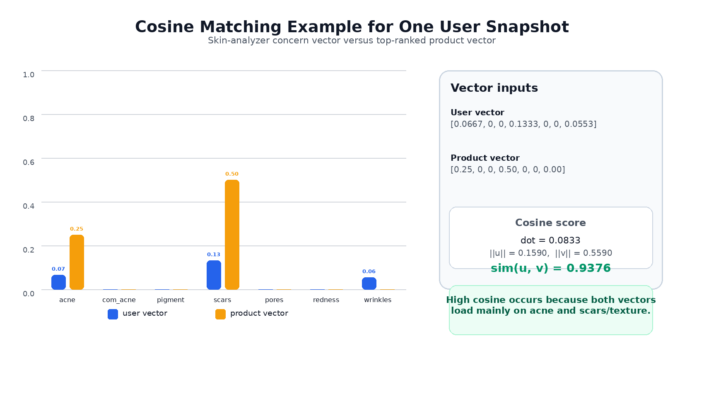
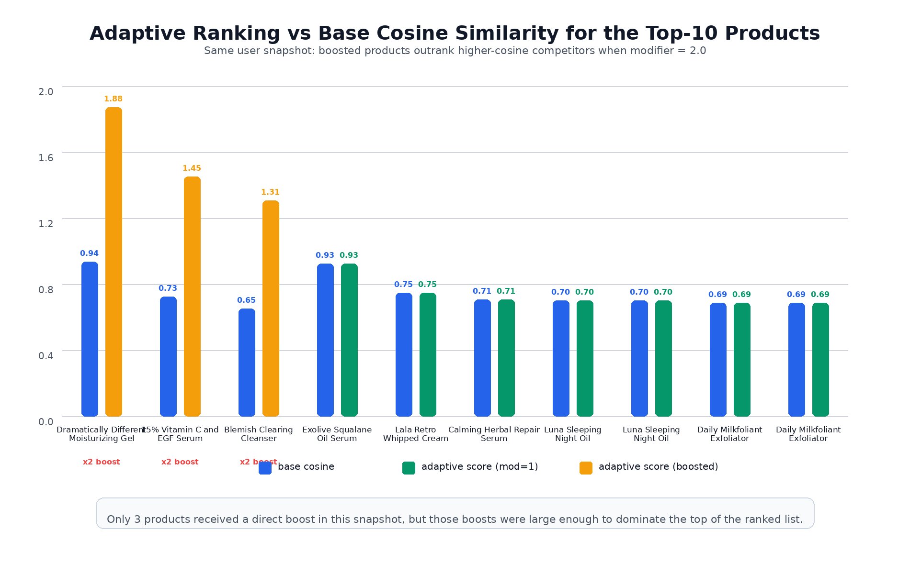
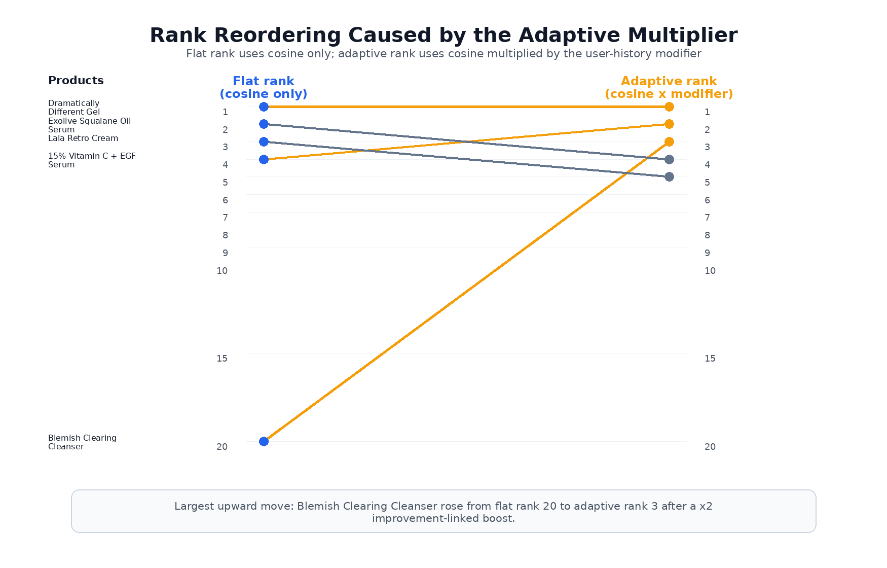

# 4.4 Hybrid Product Vectors, Cosine Matching, and Adaptive Ranking

This section reports the observed behavior of the Ruvisa recommendation layer after the product-intelligence vectors were fused and matched against the user concern profile. The ranking stack combined three ideas in a single scoring path: a shared seven-dimensional concern representation, cosine similarity for cross-sectional fit [36], and a lightweight adaptive modifier derived from user history (**defined in this work**). The main empirical finding is that the adaptive layer did not replace cosine similarity; instead, it acted as a **sparse but high-impact personalization mechanism** that only affected a small number of products directly, yet was still able to change the top of the ranked list when strong historical signals were present.

## 4.4.1 Cosine Matching Between the Skin State and Product Vector

Before interpreting the ranked list, it is useful to show how the matching score itself was produced. In Ruvisa, the output of the skin analyzer was not used as a single scalar score. Instead, it was converted into a **seven-dimensional user concern vector** in the same concern space used by the product-intelligence module. Each candidate product was likewise represented as a **seven-dimensional product vector** built from the fused ingredient-evidence and review-evidence scores. Cosine similarity was then computed between these two vectors to quantify how closely the concern emphasis of the product aligned with the current skin state [36].

For the same snapshot discussed in the remainder of this section, the latest user vector was `[0.0667, 0.0, 0.0, 0.1333, 0.0, 0.0, 0.0553]`, corresponding to a profile dominated by `acne_scars_texture`, with smaller contributions from `acne` and `wrinkles`. The top-ranked product in the cosine stage, `Dramatically Different Moisturizing Gel`, had a fused product vector of `[0.25, 0.0, 0.0, 0.50, 0.0, 0.0, 0.0]`. The resulting cosine similarity was **0.9376**, which was high because the strongest non-zero dimensions in both vectors pointed to the same concern directions, especially `acne` and `acne_scars_texture`. This is important for interpretation because it shows that the base rank was not arbitrary: it emerged from direct geometric alignment between the user's current concern burden and the product's concern-level evidence profile.

**Figure 12.** Example of cosine matching for one real user snapshot. The blue bars represent the user concern vector derived from the skin analyzer, while the orange bars represent the fused product vector for `Dramatically Different Moisturizing Gel`. The high cosine score arose because both vectors concentrated most of their weight on the same concern dimensions.

This first-stage matching result also clarifies the role of the recommender. The cosine score did not attempt to predict whether the product would certainly succeed; it measured whether the product's evidence profile targeted the same concerns that were currently most prominent for the user. The later adaptive modifier then acted on top of this base similarity to reward previously helpful products or demote historically poor matches.

## 4.4.2 Snapshot-Level Ranking Outcome

The snapshot analyzed here used `user_id = 4d105fdd9f9f7cae` with declared skin type `combination` and latest concern vector `[0.0667, 0.0, 0.0, 0.1333, 0.0, 0.0, 0.0553]`. Under this configuration, **911 products** received a finite score. Of these, **817 products (89.7%)** were skin-type compatible, meaning the ranking operated over a large but still filtered candidate pool rather than over the entire raw catalog. The base rank therefore reflects geometric vector alignment [36], while the later modifier reflects Ruvisa's explicit personalization policy (**defined in this work**).

### Table 6. Ranked products for one user snapshot

| rank | product_title | base_similarity | modifier | adaptive_score | skin_match |
| ---: | --- | ---: | ---: | ---: | :---: |
| 1 | Dramatically Different Moisturizing Gel | 0.9376 | 2.000 | 1.8751 | yes |
| 2 | 15% Vitamin C and EGF Serum | 0.7263 | 2.000 | 1.4526 | yes |
| 3 | Blemish Clearing Cleanser | 0.6539 | 2.000 | 1.3078 | yes |
| 4 | Exolive Squalane Oil Serum | 0.9271 | 1.000 | 0.9271 | yes |
| 5 | Lala Retro™ Whipped Cream | 0.7502 | 1.000 | 0.7502 | yes |
| 6 | Calming Herbal Repair Serum Concentrate Balm | 0.7084 | 1.000 | 0.7084 | yes |
| 7 | Luna Sleeping Night Oil | 0.7027 | 1.000 | 0.7027 | yes |
| 8 | Luna Sleeping Night Oil | 0.7027 | 1.000 | 0.7027 | yes |
| 9 | Daily Milkfoliant Exfoliator | 0.6896 | 1.000 | 0.6896 | yes |
| 10 | Daily Milkfoliant Exfoliator | 0.6896 | 1.000 | 0.6896 | yes |

The table shows that the highest-ranked products were not determined by cosine similarity alone. The adaptive score was approximately `base_similarity × modifier`, so products with strong history-linked boosts could outrank products with better static vector alignment. This is visible immediately in ranks 2-4. `Exolive Squalane Oil Serum` had a higher `base_similarity` (**0.9271**) than both `15% Vitamin C and EGF Serum` (**0.7263**) and `Blemish Clearing Cleanser` (**0.6539**), yet it fell below them because its modifier remained neutral at **1.000**, while the other two received a **2.000** boost.

That pattern is important because it shows that the adaptive layer was not merely producing cosmetic score adjustments. In this snapshot, the modifier materially altered the recommendation order at the very top of the list. The implication is that the deployed recommender did not behave like a static nearest-neighbor search over concern vectors. It behaved like a hybrid ranker that first measured vector alignment [36], then explicitly incorporated prior evidence about which products had helped this specific user before, consistent with the broader logic of hybrid recommendation systems [4].

The repeated appearance of `Luna Sleeping Night Oil` and `Daily Milkfoliant Exfoliator` in Table 6 did not reflect an error in the scoring formula. These rows corresponded to distinct catalog variants of the same commercial product title, such as different sizes (`15ml` vs `35ml`, `13g` vs `74g`). This detail is worth noting because it shows that ranking was performed at the **catalog-row / SKU level**, not at the deduplicated brand-title level.

**Figure 13.** Base cosine similarity versus adaptive score for the top-10 ranked products in the same user snapshot. The three history-boosted products received a `×2` multiplier and therefore outranked some products with stronger cosine similarity but neutral modifiers.

Figure 13 makes the same result visually clearer. Only the first three rows were boosted, but those boosts were large enough to separate them sharply from the rest of the top-10. The figure therefore shows that the adaptive layer was **selective rather than global**: it did not inflate the entire ranking distribution, but it strongly altered the standing of a few specific products.

## 4.4.3 How Much the Adaptive Layer Actually Changed

One useful question is whether adaptive ranking meaningfully changes the list or simply reproduces the cosine ordering with small perturbations. In this snapshot, the answer was mixed but informative.

### Table 7. Same top-five SKUs: adaptive rank vs cosine-only rank

| adaptive_rank | flat_rank | product_title | base_similarity | modifier | score_if_mod_1 (=base_sim) | adaptive_score |
| ---: | ---: | --- | ---: | ---: | ---: | ---: |
| 1 | 1 | Dramatically Different Moisturizing Gel | 0.9376 | 2.000 | 0.9376 | 1.8751 |
| 2 | 4 | 15% Vitamin C and EGF Serum | 0.7263 | 2.000 | 0.7263 | 1.4526 |
| 3 | 20 | Blemish Clearing Cleanser | 0.6539 | 2.000 | 0.6539 | 1.3078 |
| 4 | 2 | Exolive Squalane Oil Serum | 0.9271 | 1.000 | 0.9271 | 0.9271 |
| 5 | 3 | Lala Retro™ Whipped Cream | 0.7502 | 1.000 | 0.7502 | 0.7502 |

Table 7 isolates the reordering effect more directly. `Dramatically Different Moisturizing Gel` remained rank 1 under both sorting schemes, indicating that the adaptive layer did not distort every outcome. However, the other rows show meaningful movement. `15% Vitamin C and EGF Serum` rose from **flat rank 4** to **adaptive rank 2**, and `Blemish Clearing Cleanser` rose much more dramatically from **flat rank 20** to **adaptive rank 3**. Meanwhile, `Exolive Squalane Oil Serum` and `Lala Retro™ Whipped Cream` fell from flat ranks **2** and **3** to adaptive ranks **4** and **5**, despite having strong cosine scores.

This is an important empirical result because it demonstrates that the adaptive layer was doing more than reweighting ties. In particular, the jump from flat rank 20 to adaptive rank 3 for `Blemish Clearing Cleanser` shows that the user-history signal could outweigh a substantial deficit in cross-sectional similarity when prior outcome evidence strongly favored a product.

**Figure 14.** Rank reordering between cosine-only ranking and adaptive ranking for the same top-five SKUs. The largest movement was `Blemish Clearing Cleanser`, which rose from flat rank 20 to adaptive rank 3 after receiving a direct improvement-linked boost.

Figure 14 shows the same result as a rank-shift diagram. It emphasizes that the largest upward movement was not marginal. Instead, it was a large repositioning driven by the modifier. This confirms that the adaptive multiplier functioned as a real ranking policy layer, not as a negligible post-processing term.

## 4.4.4 Snapshot-Wide Modifier Summary

While the top-five tables show the most visible reordering, they do not describe how often the adaptive rules actually fired across the whole catalog. For that, the full 911-product snapshot is more informative.

### Table 8. Snapshot-wide summary of adaptive modifier behavior

| Quantity | Value |
| --- | ---: |
| Finite-score products | 911 |
| Skin-match products | 817 |
| Skin-match share | 89.7% |
| Boosted products (`modifier > 1`) | 3 |
| Penalized products (`modifier < 1`) | 0 |
| Neutral products (`modifier = 1`) | 908 |
| Products whose rank changed vs cosine-only sort | 19 |
| Share of ranked products whose position changed | 2.1% |
| Worsened concerns detected for this snapshot | none |

Table 8 reveals a subtle but important finding: the adaptive layer was **very sparse** in direct application. Only **3 of 911 products** received a non-neutral boost, and **no products** received a penalty in this particular user state. Yet despite this, **19 products** changed their position relative to the cosine-only ranking. This means that a very small number of direct interventions was sufficient to cause visible downstream reordering in the sorted list.

That sparsity is arguably desirable. If too many products were modified at once, the adaptive layer would begin to behave like an unstable second scoring model rather than a targeted personalization rule. Instead, what this snapshot shows is that adaptive ranking was mostly neutral across the catalog but decisive where strong longitudinal evidence existed.

The absence of penalties is also informative. In this user snapshot, the stored history contained **three improvement-linked products** and **no latest failed outcomes**, so the recommendation dynamics were driven entirely by positive reinforcement rather than by avoidance. Likewise, the stored concern deltas did not indicate any worsening dimensions above the threshold, so **concern boosting was inactive** here. This is useful for interpretation because it isolates the contribution of the direct boost path: the observed reordering did not depend on worsening-concern amplification or on ingredient-overlap penalties based on ingredient-set overlap (implemented in Ruvisa using Jaccard similarity [37]). It came from remembered product success alone.

## 4.4.5 Discussion

Taken together, the ranking results support three conclusions.

First, the recommendation system maintained **representation consistency** across the pipeline. The same seven concern dimensions were used for the user vector, the product vector, cosine matching, and the adaptive layer. This matters because it means the recommender was not combining incompatible feature spaces. The results can therefore be interpreted coherently: a product ranked highly because it aligned with the user's concern profile and, in some cases, because history explicitly reinforced it.

Second, the adaptive layer was **small in scope but large in effect**. Only three products were directly boosted in this snapshot, yet those three products were sufficient to alter the top of the ranking and to displace higher-cosine neutral items. This is a strong result for the design philosophy of the ranker. It suggests that the explicit policy layer succeeded in injecting user history without overwhelming the base matching signal.

Third, this snapshot demonstrates the **boost path** clearly but does not demonstrate the **penalty path**. That is not a contradiction; it is simply a property of the user's stored history at this moment. The ranking logic still supports penalties for worsened, mixed, and no-change outcomes, as well as ingredient-overlap demotion for failed products, but those branches were inactive in the present snapshot because no current failed products were present in the outcome store. As a result, the evidence from this table should be interpreted as showing that adaptive ranking can successfully promote historically helpful products, while a separate snapshot would be needed to show penalty-driven demotion equally clearly.

Overall, the results justify the use of adaptive cosine ranking in Ruvisa. The base similarity provided an interpretable notion of static skin-product fit [36], while the adaptive modifier added a minimal but meaningful form of temporal personalization (**defined in this work**). The observed behavior was therefore neither purely content-based nor purely rule-based: it was a hybrid recommender [4] in which cosine similarity defined the default structure of the ranking, and user history selectively overrode that structure where prior outcomes made such overrides useful.
