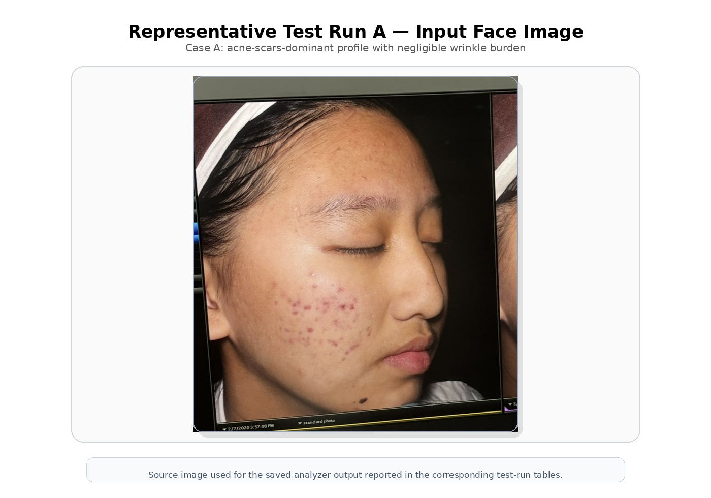
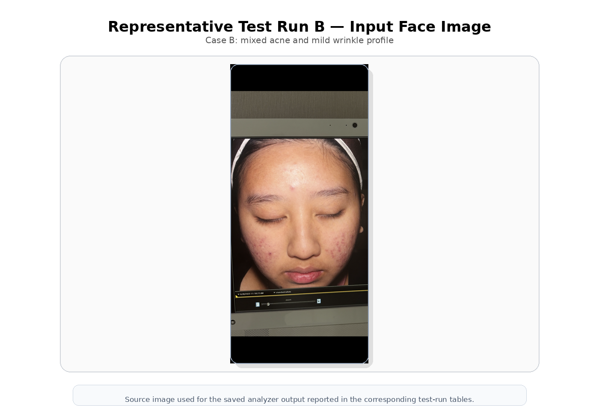
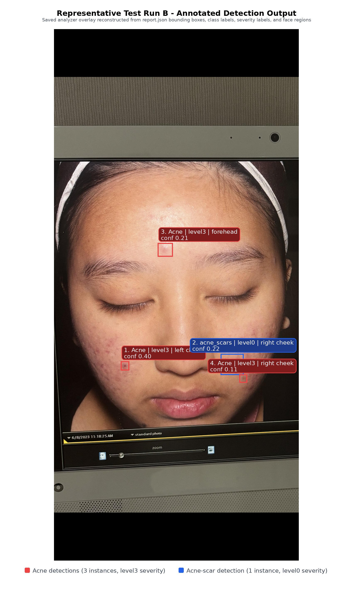

# 4. Results and Discussion — Skin Analyzer

---

## 4.1 Scope and Reporting Conventions

This section reports the observed outcomes of the Ruvisa system across computer vision, text classification, hybrid product profiling, similarity-based ranking with adaptive feedback, and tool-augmented conversational orchestration, together with qualitative end-to-end behavior of the deployed web application. Quantitative metrics were taken from saved checkpoints, recomputed validation/test evaluations, and logged cross-validation runs on the project codebase. Qualitative statements describe internal consistency checks and representative UI/API behavior, as large-scale user trials were not part of this study.

Statistical reporting conventions were as follows. YOLO detection metrics were produced by `Ultralytics model.val` on the validation split and summarized using mean precision, mean recall, mAP@50, and mAP@50-95, together with per-class precision, recall, AP@50, and AP@50-95. ResNet-18 severity metrics were computed on a held-out test split using overall accuracy, per-class precision/recall/F1, and a confusion matrix. DeBERTa metrics were computed using four-fold multilabel stratified cross-validation; fold-wise scores were summarized as mean ± standard deviation for micro-averaged precision/recall/F1, macro-F1, subset accuracy (exact match across all seven labels), and mean per-label accuracy. Where paired conditions were compared (INCI-only vs claims-oriented inputs), differences were interpreted cautiously because effective sample sizes differed slightly between modes in the logged runs.

## 4.2 Skin Image Analysis

### 4.2.1 Lesion Localization (YOLOv8-M)

The trained YOLOv8-Medium detector was evaluated on the validation split associated with the Roboflow six-class dataset used in development. The evaluation run processed **564 validation images** containing **3,097 ground-truth box instances**.

**Table 1** summarizes the overall lesion-detection performance. **Table 2** reports the per-class precision, recall, mAP@50, and mAP@50-95. **Figure 1** complements these tables by visualizing both the overall and per-class results.

### Table 1. Overall lesion-detection performance on the validation set

| Metric | Value |
| --- | ---: |
| Mean precision | 0.375 |
| Mean recall | 0.333 |
| mAP@50 | 0.300 |
| mAP@50-95 | 0.114 |

### Table 2. Per-class lesion-detection performance on the validation set

| Class | Precision | Recall | mAP@50 | mAP@50-95 |
| --- | ---: | ---: | ---: | ---: |
| Acne | 0.404 | 0.203 | 0.228 | 0.075 |
| nodule | 0.419 | 0.522 | 0.438 | 0.171 |
| blackhead | 0.414 | 0.378 | 0.347 | 0.133 |
| whitehead | 0.407 | 0.371 | 0.326 | 0.126 |
| acne_scars | 0.385 | 0.359 | 0.317 | 0.128 |
| flat_wart | 0.220 | 0.167 | 0.143 | 0.049 |

**Summary of findings (detection).** Table 1 shows moderate overall detection strength. The detector achieved **mAP@50 = 0.300** and **mAP@50-95 = 0.114**, indicating that lesion localization remained noticeably more difficult under stricter IoU thresholds than under the relaxed IoU = 0.50 criterion. Table 2 shows substantial variation across lesion categories. **Nodule** produced the strongest performance (**mAP@50 = 0.438**), whereas **flat_wart** was the weakest (**mAP@50 = 0.143**, **mAP@50-95 = 0.049**). Acne also exhibited an imbalance between precision and recall (**0.404 vs 0.203**), suggesting that the model produced some correct acne detections but still missed a considerable number of acne instances. Figure 1 presents the same pattern visually by combining the overall validation metrics with the per-class scores, making the class-wise spread easier to compare at a glance.

Wrinkle analysis was excluded from Table 2 because the implemented wrinkle module did not operate as an object-detection class within the six-class YOLO model. Instead, wrinkles were analyzed through a separate segmentation-based branch and were incorporated later during concern-vector construction.

At a more detailed level, the reported precision-recall profile suggests that the detector was more conservative than exhaustive for several classes. This was particularly visible for **acne**, where the relatively low recall indicates that many true lesions were not recovered even though the detections that were made were often plausible. In contrast, **nodule** achieved the highest recall (**0.522**) as well as the highest mAP@50, reinforcing the interpretation that larger or more visually distinct lesions were easier to localize. The validation results therefore indicate that class difficulty was not uniform, and that downstream interpretation should treat different lesion categories with different levels of confidence rather than assuming a single error profile for all detections.

**Discussion (detection).** These results suggested that open-set consumer photography remained challenging for small dermatological targets. The gap between mAP@50 and mAP@50-95 implied that the model often identified approximately correct lesion locations but struggled to maintain tight bounding-box overlap under stricter evaluation criteria. This pattern is consistent with fine-grained annotation uncertainty, lesion boundary ambiguity, and the general difficulty of small-object detection in uncontrolled lighting and pose conditions. The class-wise spread in Table 2 further suggests that lesion morphology mattered: nodules were likely easier to localize because they are visually larger and more structurally distinct, whereas flat warts were less separable from surrounding skin texture. From a system-design perspective, these results did not invalidate the detector's use, but they did justify the downstream choice to make later stages robust to imperfect proposals. In Ruvisa, lesion crops and severity estimation were therefore treated as downstream consumers of noisy detection output rather than as steps assuming perfect localization.

These findings also explained why the deployed pipeline favored a recall-oriented operating mode at inference time. In an end-to-end skincare system, a missed lesion is generally more harmful than a slightly imprecise box, because a missed lesion contributes nothing to the later severity and concern-pooling stages. By contrast, a roughly correct proposal can still yield a useful crop for classification and aggregation. The detector therefore served primarily as a proposal generator for the rest of the pipeline rather than as an endpoint whose value depended on near-perfect localization alone.

---

### 4.2.2 Lesion Severity Classification (ResNet-18, Four Levels)

The severity classifier was evaluated using the saved checkpoint deployed by the analysis service. The test split evaluation comprised **1,460 lesion crops** with four ordinal labels (`level0`-`level3`).

**Table 3** reports per-class precision, recall, F1, and support, together with the overall accuracy. **Table 4** reports the confusion matrix. **Figure 2** visualizes the confusion structure as a heatmap.

### Table 3. Severity classification performance on the test set

| Class | Precision | Recall | F1-score | Support |
| --- | ---: | ---: | ---: | ---: |
| level0 | 0.9923 | 0.9981 | 0.9952 | 515 |
| level1 | 0.9953 | 0.9906 | 0.9929 | 635 |
| level2 | 0.9889 | 0.9889 | 0.9889 | 180 |
| level3 | 1.0000 | 1.0000 | 1.0000 | 130 |
| **Overall accuracy** | — | — | **0.9938** | **1460** |

### Table 4. Confusion matrix for severity classification (test set)

Rows indicate the true class; columns indicate the predicted class.

| True \\ Pred | level0 | level1 | level2 | level3 |
| --- | ---: | ---: | ---: | ---: |
| level0 | 514 | 1 | 0 | 0 |
| level1 | 4 | 629 | 2 | 0 |
| level2 | 0 | 2 | 178 | 0 |
| level3 | 0 | 0 | 0 | 130 |

**Summary of findings (severity).** Table 3 shows very high agreement with the test labels. The classifier achieved **overall accuracy = 0.9938**, and the class-wise F1 scores all exceeded **0.988**. Table 4 shows a strongly diagonal confusion matrix, indicating that nearly all predictions fell into the correct severity category. The few observed mistakes were concentrated in adjacent classes, especially between `level0` and `level1`, or `level1` and `level2`. Figure 2 presents this diagonal dominance clearly and shows that severe cross-class confusion was effectively absent.

The support distribution in Table 3 also helps contextualize these results. Most samples lay in `level0` and `level1` (**515** and **635**, respectively), while `level2` and especially `level3` were less frequent (**180** and **130**). Despite this imbalance, performance remained high across all four classes. This suggests that the classifier did not merely overfit to the majority classes, but learned features that generalized well across the ordinal severity scale within the test distribution.

**Discussion (severity).** The confusion pattern supports the interpretation that the model learned the ordinal structure of lesion severity reliably on this dataset split. The fact that errors were adjacent rather than widely scattered suggests that most mistakes arose near severity boundaries, where visual distinction is inherently subtle, rather than from gross failure to recognize lesion intensity. This is important for deployment because the concern-vector construction stage depends more on approximate severity ordering than on perfect separation between every adjacent severity grade. At the same time, the near-perfect performance should be interpreted cautiously. It demonstrates strong consistency with the available training distribution, but it does not by itself establish clinical equivalence to dermatologist grading in real-world practice. The perfect test result for `level3` should also be interpreted in light of the smaller support (**130 samples**) relative to `level0` and `level1`.

Another important implication is that the severity classifier appeared substantially stronger than the detector that supplied its crops. This contrast suggests that once a lesion region was isolated, the local visual cues for severity were comparatively learnable. In practice, this means the primary bottleneck of the computer-vision pipeline was lesion proposal quality rather than lesion-grade recognition. The deployment consequence is that future improvements to the skin-analysis subsystem would likely benefit more from strengthening localization and small-object detection than from replacing the existing severity classifier.

---

### 4.2.3 Regional Summaries and Concern-Vector Construction (Integration Outcome)

Beyond per-detection outputs, the deployed pipeline assigned each detection to a face region using centroid-in-mask tests and aggregated mean severity scores and counts per region for reporting. A global user concern vector was then derived by mapping detections into the shared concern space used by the recommender, together with wrinkle and texture signals when enabled.

**Summary of findings (integration).** This stage was primarily an integration outcome rather than a standalone benchmark. The key empirical result was internal consistency: the same concern representation used downstream for product ranking could be traced back to concrete image-analysis outputs, namely lesion detections, severity estimates, wrinkle measurements, and concern mapping rules. In other words, the deployed system preserved a coherent data flow from raw face image to recommendation-ready user vector.

This result is important because the skin analyzer was not intended to end at lesion detection or crop classification. Its practical role within Ruvisa was to convert visual evidence into a machine-readable state representation that the recommendation layer could use directly. The successful construction of a stable concern vector therefore functioned as the operational bridge between the computer-vision stage and the later ranking, matching, and conversational modules.

**Discussion (integration).** This integration step is significant because it links the computer-vision subsystem to the recommendation subsystem through a common numerical representation. A limitation remains in the regional assignment method: lesions whose boxes cross facial boundaries may be assigned imperfectly to a single region. However, this mainly affects local reporting rather than the final global concern vector, because the implemented pooling function operates primarily at the concern level rather than applying strong region-specific weighting. Consequently, minor regional misassignments are unlikely to dominate the final recommendation state, although they may affect user-facing interpretability of region summaries. Overall, the integration results support the claim that the skin-analysis stage did not operate as an isolated benchmark module, but as a coherent front-end to the downstream recommendation system.

More broadly, the integration outcome supports the architectural choice made in Ruvisa: a moderately accurate detector combined with a highly reliable severity classifier can still yield a useful end-to-end user representation if the aggregation layer is designed to absorb localized noise. This is particularly relevant in consumer skincare settings, where image capture conditions are uncontrolled and perfect lesion-level annotation fidelity is unrealistic. The results therefore suggest that the practical value of the skin analyzer lies not only in standalone benchmark scores, but also in its ability to produce stable downstream concern signals under imperfect upstream conditions.

### 4.2.4 Region-Level and Whole-Face Outputs

Beyond benchmark accuracy, the deployed skin analyzer produced three types of user-facing outputs: **per-lesion severity**, **regional summaries**, and an **overall face score**. These outputs were important because they determined how the raw model predictions were translated into information that a user could understand and that the recommender could use.

At the **per-lesion level**, each detected lesion was assigned both a lesion type and a severity grade. In practice, this meant that the analyzer did not merely say that acne or comedonal lesions were present; it also indicated whether those lesions appeared closer to mild, moderate, or severe intensity. This made the output substantially richer than a simple lesion count and allowed the pipeline to distinguish between a face with many very mild findings and a face with fewer but more severe findings.

At the **regional level**, the pipeline summarized lesions by facial zone, including the forehead, cheeks, chin, and T-zone. In this context, the reported ROI functioned as a **regional burden score**, summarizing how severe the lesions in that region were on average. Regions with no detections were assigned a clear or near-zero burden, whereas regions containing multiple high-severity lesions received worse scores. Wrinkle analysis added a second type of regional summary by measuring wrinkle coverage in zones such as the forehead, under-eye area, nasolabial region, and crow's feet. As a result, the app did not only state that wrinkles were present; it also localized where wrinkle burden was most visible.

At the **whole-face level**, these outputs were combined into a single overall face score intended for user-facing interpretation. The important practical behavior of this score was that it decreased when the average concern burden increased and remained within a bounded range so that it stayed visually stable across scans. This made the score suitable for longitudinal comparison inside the app, where users are more interested in whether their skin looks better or worse over time than in the exact internal scaling rule.

A representative user example illustrates how these outputs worked together. If a user uploaded an image containing several moderate acne lesions concentrated in the cheeks and chin, together with relatively low wrinkle coverage, the analyzer would produce: (i) multiple acne detections with mid-range severity labels, (ii) higher ROI or burden values for cheek and chin regions than for the forehead, (iii) a concern vector dominated by the acne-related dimensions, and (iv) a lower overall face score than a user whose detections were sparse and mostly mild. Conversely, a user with relatively few lesions but visible forehead and crow's-feet wrinkles would show weaker acne-region burden but higher wrinkle-region summaries, shifting the downstream concern vector toward the wrinkles dimension. In this way, the same pipeline could differentiate between users whose dominant needs were acne-focused and users whose dominant needs were aging-related.

From a discussion perspective, this output hierarchy was one of the strongest aspects of the deployed skin analyzer. The system did not stop at model predictions; it converted them into layered summaries that were useful at different levels of abstraction. Per-lesion outputs preserved fine detail, region-level summaries improved interpretability, and the overall score supported longitudinal tracking. This design made the analyzer more suitable for a consumer skincare platform, where users need both actionable summaries and continuity over time rather than only low-level computer-vision predictions.

### 4.2.5 Representative User Results from Saved Test Runs

To illustrate what the deployed analyzer actually produced in practice, two saved test runs from the Ruvisa pipeline were examined. These examples are not hypothetical; they were taken from previously generated system reports and show how the detector, severity classifier, regional summaries, wrinkle branch, and final concern vector behaved together on real user images.

### Table 5. Representative analyzer output from saved test run A

| Field | Result |
| --- | --- |
| Profile type | Acne-scars-dominant with negligible wrinkle burden |
| Total detections | 24 |
| Concern vector | `[0.4333, 0.05, 0.0, 0.6146, 0.0, 0.0, 0.0]` |
| Dominant concerns | `acne_scars_texture`, then `acne` |
| Overall face score | 87 |
| Wrinkle coverage | 0.04% |
| Wrinkle severity | none |

### Table 6. Regional summary for saved test run A

| Region | Detection count | ROI |
| --- | ---: | ---: |
| Forehead | 3 | 0.3333 |
| Left cheek | 10 | 0.1667 |
| Right cheek | 9 | 0.2593 |
| Chin | 2 | 0.1667 |

### Table 7. Zone scores for saved test run A

| Zone | Score |
| --- | ---: |
| Forehead | 90 |
| T-Zone | 45 |
| Cheeks | 88 |
| Under Eyes | 85 |
| Crow's Feet | 87 |

**Figure 4.** Source image used for the representative saved analyzer output in test run A. The visible cheek-dominant lesion pattern is consistent with the elevated acne and acne-scars-texture burden reported in Tables 5-7.

In this first case, the cheeks contained the largest number of lesions, but the final concern profile was driven most strongly by **acne_scars_texture** rather than acne alone. This reflects the fact that the analyzer aggregated lesion type and severity jointly rather than simply counting detections. The near-zero wrinkle signal and the low T-zone score together indicate that this user was primarily lesion-dominant, with the most important downstream concern dimensions arising from acne and textural scarring.

### Table 8. Representative analyzer output from saved test run B

| Field | Result |
| --- | --- |
| Profile type | Mixed acne + mild wrinkle profile |
| Total detections | 4 |
| Concern vector | `[0.30, 0.0, 0.0, 0.05, 0.0, 0.0, 0.3333]` |
| Dominant concerns | `wrinkles`, then `acne` |
| Overall face score | 92 |
| Wrinkle coverage | 0.777% |
| Wrinkle severity | mild |

### Table 9. Regional summary for saved test run B

| Region | Detection count | ROI |
| --- | ---: | ---: |
| Forehead | 1 | 1.0 |
| Left cheek | 1 | 1.0 |
| Right cheek | 2 | 0.5 |
| Chin | 0 | 0.0 |

### Table 10. Zone scores for saved test run B

| Zone | Score |
| --- | ---: |
| Forehead | 90 |
| T-Zone | 69 |
| Cheeks | 88 |
| Under Eyes | 85 |
| Crow's Feet | 87 |

**Figure 5.** Source image used for the representative saved analyzer output in test run B. Compared with test run A, the face image shows a lighter lesion burden, which is consistent with the lower detection count, higher overall face score, and mixed acne-wrinkle concern profile reported in Tables 8-10.

**Figure 6.** Annotated detection overlay for the representative saved analyzer output in test run B. The saved report contained four detections: three acne detections labeled as `level3` and one `acne_scars` detection labeled as `level0`, distributed across the forehead, left cheek, and right cheek. This visual output matches the low total detection count and mixed concern profile summarized in Tables 8-10.

In the second case, the analyzer produced far fewer lesion detections, but the wrinkle branch contributed a non-zero wrinkle dimension and shifted the overall profile away from being purely acne-driven. The higher overall score of **92** relative to case A reflects the lighter combined burden. This case therefore demonstrates that the deployed pipeline did not simply respond to lesion count; it differentiated between users with predominantly acne-related concerns and users with mixed low-lesion, mild-wrinkle presentations.

Taken together, these two real saved reports show that the analyzer mapped visually different users to meaningfully different concern profiles. One case was dominated by acne scars and lesion burden with almost no wrinkle contribution, while the other combined a smaller number of acne findings with a measurable wrinkle signal. This indicates that the concern-vector construction step preserved clinically relevant variation in skin presentation rather than collapsing all users into a single generic acne profile.

### 4.2.6 Cross-Stage Interpretation

Taken together, the results reveal an important asymmetry in the skin-analysis pipeline. The **detection** stage remained the harder problem, with only moderate localization quality and clear class-dependent variation, whereas the **severity classification** stage performed very strongly once lesion crops were available. This division of difficulty is visible when comparing Table 1 and Table 3: lesion proposal quality limited the front end of the pipeline, while ordinal lesion interpretation was comparatively reliable on the held-out test split.

From a systems perspective, this asymmetry is meaningful. The recommendation engine in Ruvisa does not consume raw bounding boxes directly; instead, it consumes the aggregated concern vector produced after detection, severity estimation, and mapping. As a result, the skin analyzer did not need perfect detector-level performance to be useful. It needed sufficient sensitivity to recover the dominant visual concerns and sufficient stability in downstream scoring so that the final concern vector remained consistent with the observed skin state. The results suggest that this condition was met: the detector provided imperfect but usable lesion proposals, the severity model supplied highly reliable local grading, and the aggregation stage converted these outputs into a coherent shared representation for downstream ranking and personalization.

At the same time, the results indicate where future gains are most likely. Improvements in **small-lesion localization**, class balancing for difficult categories such as flat warts, and stronger box refinement would likely have a larger effect on end-to-end skin-analysis quality than further optimization of the already high-performing severity classifier. In other words, the most promising direction for future work is not deeper severity modeling, but stronger early-stage proposal quality and robustness under real-world consumer image conditions.

### 4.2.7 Practical Significance for Ruvisa

The practical value of the skin analyzer lies in its ability to transform an unconstrained user selfie into a structured representation that can drive the rest of the Ruvisa pipeline. In this respect, the results were sufficiently strong for operational use even though the lesion detector was not close to ceiling performance. The recommendation layer requires a stable estimate of which concern dimensions are active and how strongly they should be weighted; it does not require every lesion to be perfectly localized. This distinction is important because it means that utility at the system level depends more on the reliability of the final concern profile than on detector mAP alone.

The observed performance profile supports this use case. The detector was strong enough to recover many clinically relevant visual cues, while the severity classifier and aggregation logic stabilized these cues into a concern vector that could be consumed by the matching and ranking modules. In practice, this meant that the skin analyzer functioned as a prioritization mechanism: it identified which concerns should receive more weight in later recommendation, rather than acting as a standalone diagnostic endpoint. This is a more realistic role for a consumer skincare application, where the objective is personalized product guidance rather than formal medical diagnosis.

These results also suggest that the skin analyzer contributed interpretability to the broader Ruvisa system. Because the concern vector was derived from explicit detections, severity assignments, wrinkle measurements, and concern mappings, downstream recommendations could be traced back to visible image-based evidence. This traceability is valuable in user-facing systems because it allows recommendations to be justified in terms that are understandable to users, such as elevated acne burden, visible pigmentation, or localized wrinkle severity.

### 4.2.8 Limitations of the Skin-Analysis Results

Several limitations should be considered when interpreting these findings. First, the detector and severity classifier were evaluated on development-aligned datasets rather than on an external clinical benchmark, so the reported scores primarily reflect performance within the available data distribution. Second, the lesion-localization metrics indicate that small-object sensitivity and precise box alignment remained limited, especially for visually subtle categories. Third, although the severity classifier performed extremely well on the held-out split, high test accuracy alone does not guarantee robustness under shifts in camera quality, illumination, skin tone diversity, cosmetic occlusion, or image compression.

Another limitation is that the integration stage was validated mainly through internal consistency and deployment checks rather than a separate quantitative benchmark for concern-vector fidelity. In other words, the system demonstrated that it could produce a coherent downstream vector, but this study did not independently evaluate whether each concern dimension aligned with dermatologist-assigned concern severity at the person level. Consequently, the current evidence supports the usefulness of the skin analyzer as an engineering component within Ruvisa, but not as a substitute for expert clinical assessment.

### 4.2.9 Overall Interpretation

Overall, the skin-analysis results indicate that Ruvisa's computer-vision front end was effective as a **decision-support and personalization module**. The detector did not achieve high localization precision under strict overlap criteria, but it produced enough useful proposals to support later stages. The severity classifier then converted those proposals into highly reliable ordinal estimates, and the aggregation layer transformed them into a downstream-ready concern representation. Taken together, these findings justify the role of the skin analyzer in the Ruvisa architecture: not as a perfectly accurate lesion benchmark in isolation, but as a practically useful and internally coherent source of personalized concern signals for recommendation, tracking, and conversational explanation.
